<h1 align="center">TinyVision</h1>
<p align="center">TinyVision - A Tiny Linux Board / IPC / Server / Router / And so on...</p>


# 功能特性

- TinyVision是适用于 Linux主板、IPC、服务器、路由器等的终极一体化解决方案。 TinyVision 采用先进的 Allwinner V851se 或 V851s3 处理器，以紧凑的外形提供卓越的性能和多功能性。
- TinyVision 的 Cortex-A7 内核运行频率高达 1200MHz，RISC-V E907GC@600MHz，可在保持能源效率的同时提供强大的处理能力。 集成的0.5Tops@int8 NPU可为各种应用提供高效的AI推理。
- TinyVision 配备 64M DDR2 (V851se) 或 128M DDR3L (V851s3) 内置内存选项，确保流畅、无缝的操作。 TF 卡插槽支持 UHS-SDR104，为您的数据需求提供可扩展的存储空间。 此外，板载 SD NAND 和 USB&UART Combo 接口提供便捷的连接选项。
- 通过 TinyVision 对 2 通道 MIPI CSI 输入的支持，增强您基于视觉的应用程序，从而实现高级相机功能的无缝集成。 独立的 ISP 可实现高分辨率图像处理，支持高达 2560 x 1440 的分辨率。
- 借助 TinyVision 的 H.264/H.265 解码功能（分辨率高达 4096x4096）享受身临其境的视频体验。 使用 H.264/H.265 编码器捕捉和编码令人惊叹的时刻，支持高达 3840x2160@20fps 的分辨率。 借助在线视频编码支持，您可以轻松共享和流式传输您的内容。
- 为了提供可靠的实时操作系统支持，TinyVision 利用基于 RT-Thread + RTOS-HAL 的 RISC-V E907 RTOS 的强大功能，确保最佳性能和稳定性。
- 无论您喜欢 Linux 环境还是实时控制，TinyVision 都能满足您的需求。 它支持 OpenWrt 23.05、Buildroot 和 Mainline Linux 6.7 等 GNU/Linux 版本，满足不同的软件需求。 
- 对于实时控制爱好者来说，基于 RT-Thread + RTOS-HAL 的 RISC-V E907 RTOS 支持可提供快速可靠的性能。
- TinyVision 是一款紧凑而强大的解决方案，适用于您的 Linux 主板、IPC、服务器、路由器等，释放无限可能。 体验无与伦比的性能、增强的功能和无缝集成。 选择 TinyVision 并改变您的创新方式。


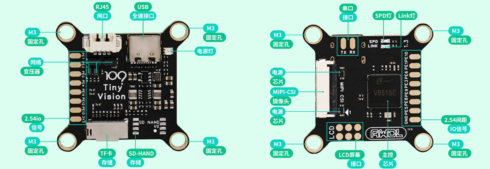

- Based on Allwinner V851se / V851s3
- Cortex-A7 Core up to 1200MHz
- RISC-V E907GC@600MHz
- 0.5Tops@int8 NPU
- Built in 64M DDR2 (V851se) / 128M DDR3L (V851s3) memory
- One TF Card Slot, Support UHS-SDR104
- On board SD NAND
- On board USB&UART Combo
- Supports one 2-lane MIPI CSI inputs
- Supports 1 individual ISP, with maximum resolution of 2560 x 1440
- H.264/H.265 decoding at 4096x4096
- H.264/H.265 encoder supports 3840x2160@20fps
- Online Video encode
- RISC-V E907 RTOS Support, Based on RT-Thread + RTOS-HAL

# 芯片框图

## V851 系列


## 不同型号芯片的区别

| 芯片型号 | 内存       | 内置网络PHY | 显示接口                                        |
| -------- | ---------- | ----------- | ----------------------------------------------- |
| V851s    | 64M DDR2   | 无          | 2-lane MIPI + RGB + MIPI DBI TypeC, 1280x720@60 |
| V851se   | 64M DDR2   | 10/100M     | MIPI DBI TypeC, 320x240@30                      |
| V851s3   | 128M DDR3L | 无          | 2-lane MIPI + RGB + MIPI DBI TypeC, 1280x720@60 |
| V851s4   | 256M DDR3L | 无          | 2-lane MIPI + RGB + MIPI DBI TypeC, 1280x720@60 |

## 配套模块

### TypeC-SBUUart

https://item.taobao.com/item.htm?id=761016078439&


### SPI显示屏

https://item.taobao.com/item.htm?id=761016078439&

### WIFI模块

https://item.taobao.com/item.htm?id=761016078439&

### GC2053摄像头

* GC2053摄像头: https://item.taobao.com/item.htm?&id=736796459015


### 百兆RJ45头

* RJ45 百兆线（选择4P转水晶头 50CM）: https://item.taobao.com/item.htm?&id=626832235333

# 快速上手

## 制作系统启动镜像

### 硬件要求

当您购买了一套全新的TinyVision异构视觉AI开发套件，包装盒内会有：

1.TinyVision开发板

您还需要额外的：

1.microSD卡(建议最低8GB） x1

2.TypeC-SUB调试器 x1  https://item.taobao.com/item.htm?id=761016078439&

3.40Gbps数据线 x1 https://item.taobao.com/item.htm?id=761016078439&

4.type-C数据线 x2 https://item.taobao.com/item.htm?id=761016078439&

5.USB读卡器 x1

> 注意：使用时还需要一台正常工作且能连接互联网的PC电脑。

### 系统选择

TinyVision V851se支持多种不同的系统，有主线，有原厂BSP，有RTOS等等，在首次启动，您需要选择一个合适的系统，这里我们以兼容性最好，功能最全的Tina-SDK系统镜像为例，下载地址：[https://github.com/YuzukiHD/TinyVision/releases]  下载固件  `v851se_linux_tinyvision_uart0.zip` 保存至电脑。之后进行烧写操作。

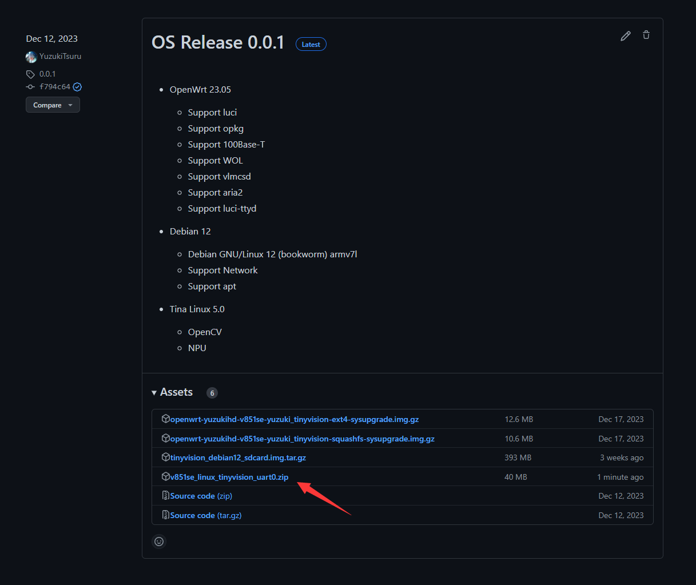

### 烧写系统

- 硬件：TinyVision主板 x1
- 硬件：TypeC-SUB x1
- 硬件：TF卡读卡器 x1
- 硬件：8GB以上的 Micro TF卡 x1
- 软件：Tina系统TF卡烧录工具: [PhoenixCard-V2.8](https://gitlab.com/dongshanpi/tools/-/raw/main/PhoenixCard-V2.8.zip)
- 软件：TinaTF卡最小系统镜像：`tina_v851se-tinyvision_uart0.img` 

烧录过程请参考下述步骤：

1. 打开 已经下载好的 PhoenixCard-V2.8 烧录工具运行起来，点击 **固件**
2. 在弹出的对话框内，找到我们已经下载好的Tina系统镜像，按照 序号  2 、3 依次选择。
3. 选择好固件后，点击 序号 4 选择为 启动卡，之后 点击 序号 5   烧卡进行烧录。
4. 烧录完成后，如下蓝框 序号6 log提示，会提示 烧写完成，此时 拔下 TF卡即可进行后续启动步骤。

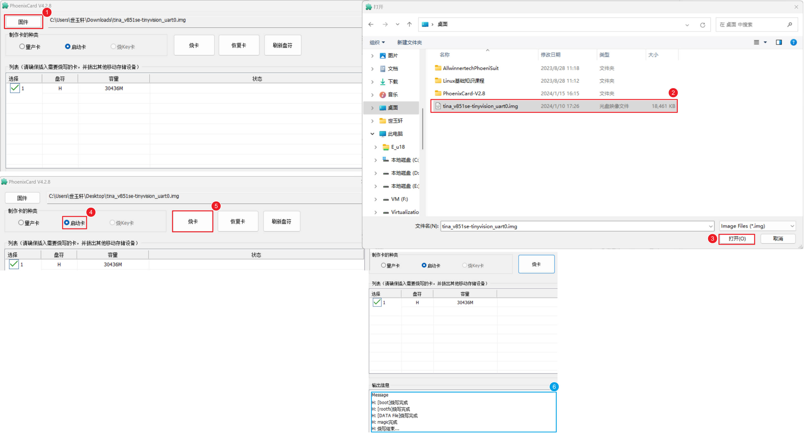

### 插卡启动

在开发板启动前需要先将SD卡接入开发板，如下图所示：

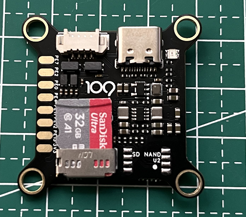


使用 40Gbps 数据线连接TinyVision开发板和TypeC-SUB调试器，如下图所示**（Yuzuki注：下图拍错了懒得换，得反过来插，TypeC-SUB调试器背面对着TinyVision有SD卡的那一面，拍照人已经扣钱了）：**

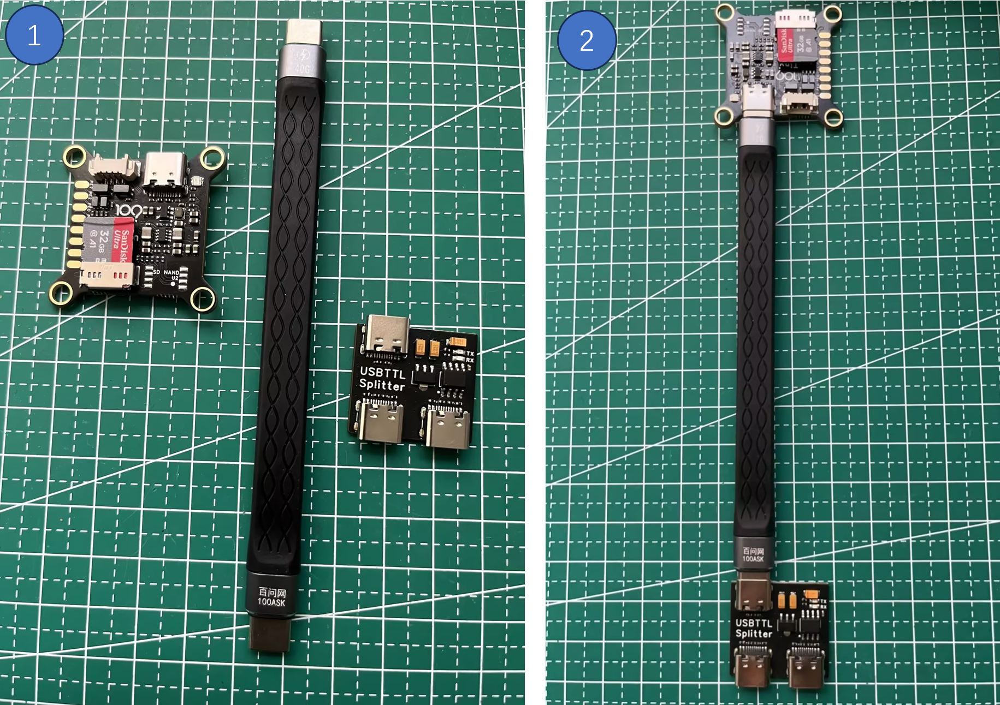

使用两条Type-C连接TypeC UART调试器和电脑端，连接完成后即可启动系统.

## 使用串口登录系统

### 1. 连接串口线

将配套的TypeC线一段连接至开发板的串口/供电接口，另一端连接至电脑USB接口，连接成功后板载的红色电源灯会亮起。
默认情况下系统会自动安装串口设备驱动，如果没有自动安装，可以使用驱动精灵来自动安装。

* 对于Windows系统
  此时Windows设备管理器 在 端口(COM和LPT) 处会多出一个串口设备，一般是以 `USB-Enhanced-SERIAL CH9102`开头，您需要留意一下后面的具体COM编号，用于后续连接使用。

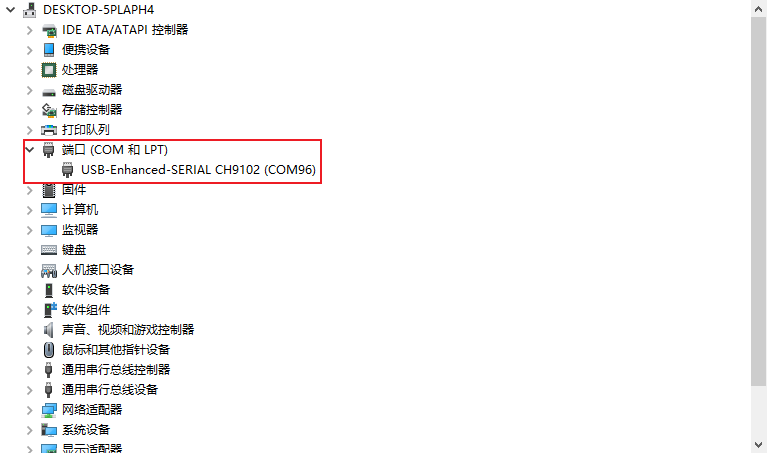

如上图，COM号是96，我们接下来连接所使用的串口号就是96。

* 对于Linux系统
  可以查看是否多出一个/dev/tty 设备,一般情况设备节点为 /dev/ttyACM0  。

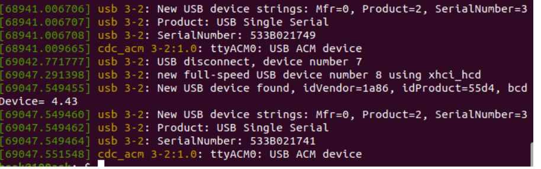

### 2. 打开串口控制台

#### 2.1 获取串口工具

使用Putty或者MobaXterm等串口工具来开发板设备。

* 其中putty工具可以访问页面  https://www.chiark.greenend.org.uk/~sgtatham/putty/  来获取。
* MobaXterm可以通过访问页面 https://mobaxterm.mobatek.net/ 获取 (推荐使用)。

#### 2.2 使用putty登录串口

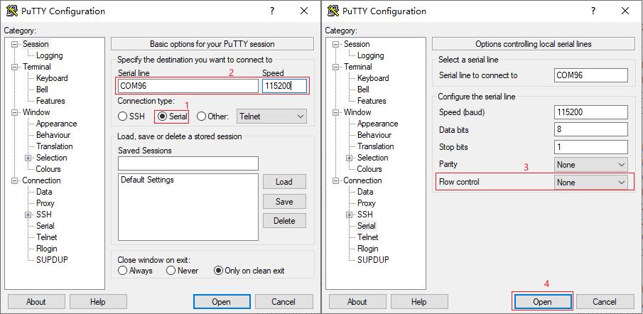

#### 2.3 使用Mobaxterm登录串口

打开MobaXterm，点击左上角的“Session”，在弹出的界面选中“Serial”，如下图所示选择端口号（前面设备管理器显示的端口号COM21）、波特率（Speed 115200）、流控（Flow Control: none）,最后点击“OK”即可。步骤如下图所示。
**注意：流控（Flow Control）一定要选择none，否则你将无法在MobaXterm中向串口输入数据**

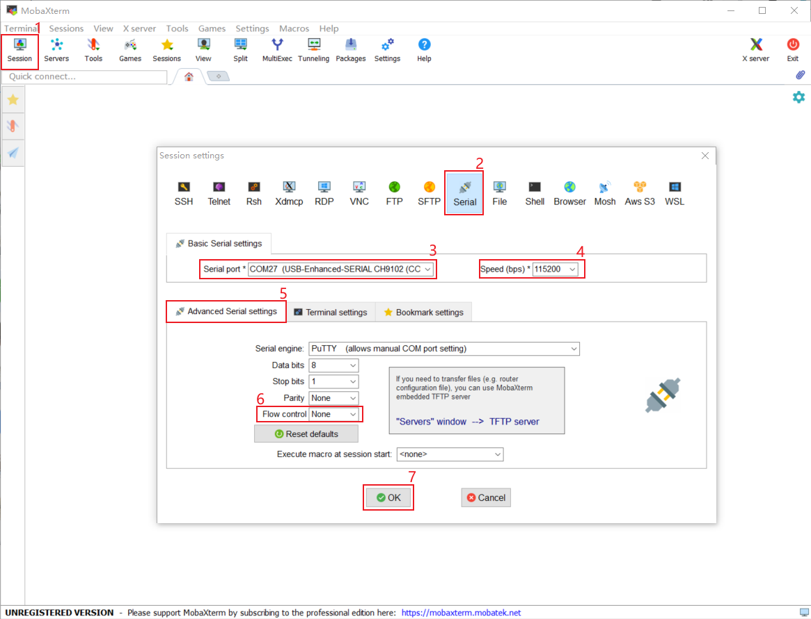


### 3. 进入系统shell

使用串口工具成功打开串口后，可以直接按下 Enter 键 进入shell，当然您也可以按下板子上的 `Reset`复位键，来查看完整的系统信息。

``` bash
[34]HELLO! BOOT0 is starting!
[37]BOOT0 commit : 88480af
[40]set pll start
[42]periph0 has been enabled
[44]set pll end
[46][pmu]: bus read error
[48]board init ok
[50]ZQ value = 0x2f
[52]get_pmu_exist() = -1
[54]DRAM BOOT DRIVE INFO: V0.33
[57]DRAM CLK = 528 MHz
[59]DRAM Type = 2 (2:DDR2,3:DDR3)
[62]DRAMC read ODT  off.
[65]DRAM ODT off.
[67]ddr_efuse_type: 0xa
[69]DRAM SIZE =64 M
[71]dram_tpr4:0x0
[73]PLL_DDR_CTRL_REG:0xf8002b00
[76]DRAM_CLK_REG:0xc0000000
[78][TIMING DEBUG] MR2= 0x0
[83]DRAM simple test OK.
[85]dram size =64
[87]spinor id is: ef 40 18, read cmd: 6b
[90]Succeed in reading toc file head.
[94]The size of toc is 100000.
[139]Entry_name        = opensbi
[142]Entry_name        = u-boot
[146]Entry_name        = dtb
▒149]Jump to second Boot.

U-Boot 2018.05-g24521d6 (Feb 11 2022 - 08:52:39 +0000) Allwinner Technology

[00.158]DRAM:  64 MiB
[00.160]Relocation Offset is: 01ee7000
[00.165]secure enable bit: 0
[00.167]CPU=1008 MHz,PLL6=600 Mhz,AHB=200 Mhz, APB1=100Mhz  MBus=300Mhz
[00.174]flash init start
[00.176]workmode = 0,storage type = 3
individual lock is enable
[00.185]spi sunxi_slave->max_hz:100000000
SF: Detected w25q128 with page size 256 Bytes, erase size 64 KiB, total 16 MiB
[00.195]sunxi flash init ok
[00.198]line:703 init_clocks
[00.201]drv_disp_init
request pwm success, pwm7:pwm7:0x2000c00.
[00.218]drv_disp_init finish
[00.220]boot_gui_init:start
[00.223]set disp.dev2_output_type fail. using defval=0
[00.250]boot_gui_init:finish
partno erro : can't find partition bootloader
54 bytes read in 0 ms
[00.259]bmp_name=bootlogo.bmp size 38454
38454 bytes read in 1 ms (36.7 MiB/s)
[00.434]Loading Environment from SUNXI_FLASH... OK
[00.448]out of usb burn from boot: not need burn key
[00.453]get secure storage map err
partno erro : can't find partition private
root_partition is rootfs
set root to /dev/mtdblock5
[00.464]update part info
[00.467]update bootcmd
[00.469]change working_fdt 0x42aa6da0 to 0x42a86da0
No reserved memory region found in source FDT
FDT ERROR:fdt_get_all_pin:get property handle pinctrl-0 error:FDT_ERR_INTERNAL
sunxi_pwm_pin_set_state, fdt_set_all_pin, ret=-1
[00.494]LCD open finish
[00.510]update dts
```

**系统默认会自己登录 没有用户名 没有密码。**
**系统默认会自己登录 没有用户名 没有密码。**
**系统默认会自己登录 没有用户名 没有密码。**

## Windows下使用 ADB登录系统

### 1.连接OTG线

将开发板配套的两根typec线，一根 直接连接至 开发板 `黑色字体序号 3.OTG烧录接口` 另一头连接至电脑的USB接口，开发板默认有系统，接通otg电源线就会通电并直接启动。

### 2.安装Windows板ADB

点击链接下载Windows版ADB工具 [adb-tools](https://gitlab.com/dongshanpi/tools/-/raw/main/ADB.7z)
下载完成后解压，可以看到如下目录，

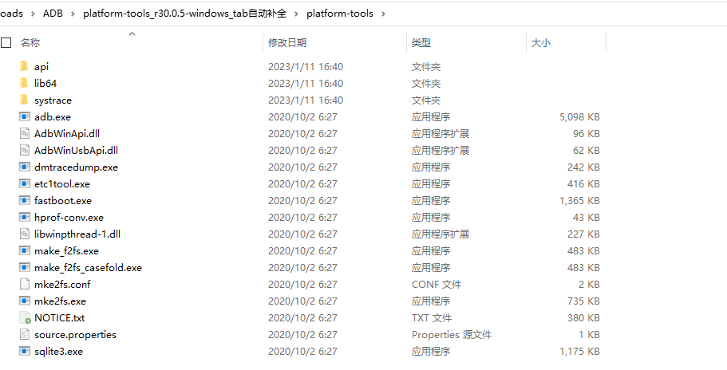

然后 我们单独 拷贝 上一层的 **platform-tools** 文件夹到任意 目录，拷贝完成后，记住这个 目录位置，我们接下来要把这个 路径添加至 Windows系统环境变量里。

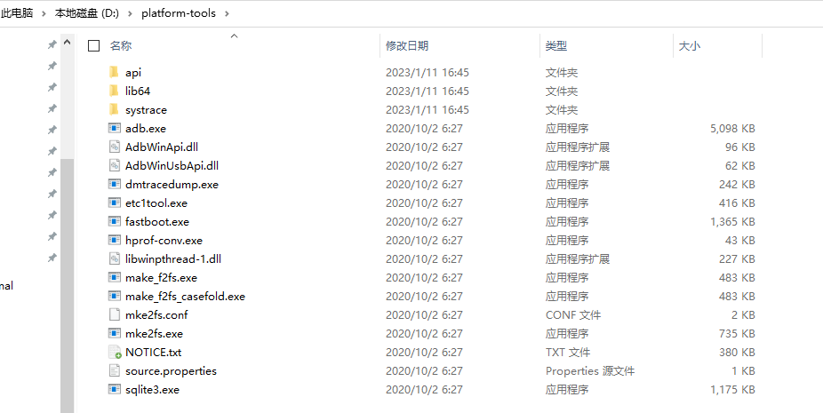

我这里是把它单独拷贝到了 D盘，我的目录是 `D:\platform-tools` 接下来 我需要把它单独添加到Windows系统环境变量里面才可以在任意位置使用adb命令。


添加到 Windows系统环境变量里面
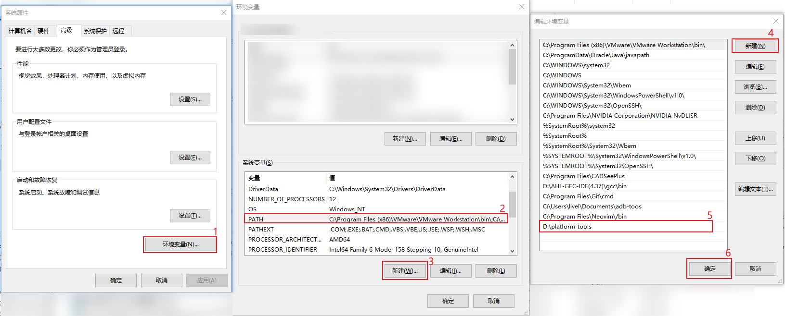

### 3.打开cmd连接开发板

打开CMD Windows 命令提示符方式有两种
方式1：直接在Windows10/11搜索对话框中输入  cmd 在弹出的软件中点击  `命令提示符`
方式2：同时按下 wind + r 键，输入 cmd 命令，按下确认 就可以自动打开 `命令提示符`

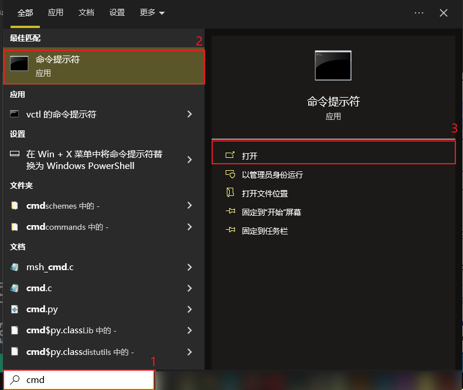

打开命令提示符，输出 adb命令可以直接看到我们的adb已经配置成功

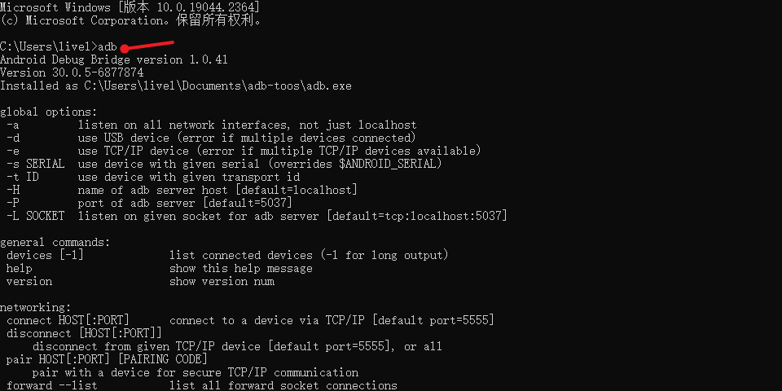

连接好开发板的 OTG 并将其连接至电脑上，然后 输入 adb shell就可以自动登录系统

``` shell
C:\System> adb shell
* daemon not running. starting it now on port 5037 *
* daemon started successfully *

 _____  _              __     _
|_   _||_| ___  _ _   |  |   |_| ___  _ _  _ _
  | |   _ |   ||   |  |  |__ | ||   || | ||_'_|
  | |  | || | || _ |  |_____||_||_|_||___||_,_|
  |_|  |_||_|_||_|_|  Tina is Based on OpenWrt!
 ----------------------------------------------
 Tina Linux
 ----------------------------------------------
root@TinaLinux:/#

```

ADB 也可以作为文件传输使用，例如：

``` shell
C:\System> adb push badapple.mp4 /mnt/UDISK   # 将 badapple.mp4 上传到开发板 /mnt/UDISK 目录内
```

``` shell
C:\System> adb pull /mnt/UDISK/badapple.mp4   # 将 /mnt/UDISK/badapple.mp4 下拉到当前目录内
```

**注意： 此方法目前只适用于 使用全志Tina-SDK 构建出来的系统。**

# 系统刷写

系统下载地址：[https://github.com/YuzukiHD/TinyVision/releases] 

## 原厂SDK系统

- 硬件兼容性 ⭐⭐⭐⭐⭐
- 软件功能完善度 ⭐⭐⭐⭐⭐
- 开发使用难度 ⭐⭐⭐⭐⭐
- 烧写工具 全志自家烧录器。

### TinaSDK-5.0

#### TF卡系统镜像

- `v851se_linux_tinyvision_uart0.zip`
  - 默认TinaSDK编译出来

  - 支持ADB

  - 和默认SDK兼容性最好


## 主线Linux系统

- TF卡读卡器 x1
- 8GB以上的 micro TF卡 x1
- win32diskimage工具 : https://gitlab.com/dongshanpi/tools/-/raw/main/win32diskimager-1.0.0-install.exe
- SDcard专用格式化工具：https://gitlab.com/dongshanpi/tools/-/raw/main/SDCardFormatter5.0.1Setup.exe
- Etcher 烧写工具下载：https://etcher.balena.io/#download-etcher


* 使用Win32Diskimage烧录：需要下载 **win32diskimage SDcard专用格式化** 这两个烧写TF卡的工具。

- 使用SD CatFormat格式化TF卡，注意备份卡内数据。参考下图所示，点击刷新找到TF卡，然后点击 Format 在弹出的 对话框 点击 **是(Yes)**等待格式完成即可。

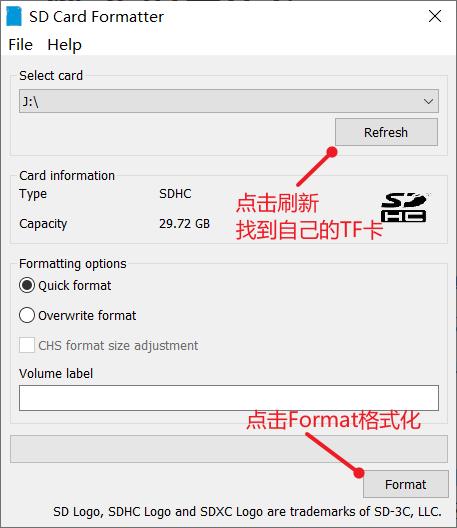

- 格式化完成后，使用**Win32diskimage**工具来烧录镜像，参考下属步骤，找到自己的TF卡盘符，然后点击2 箭头 文件夹的符号 找到 刚才解压的 TF卡镜像文件 **dongshannezhastu-sdcard.img** 最后 点击 写入，等待写入完成即可。

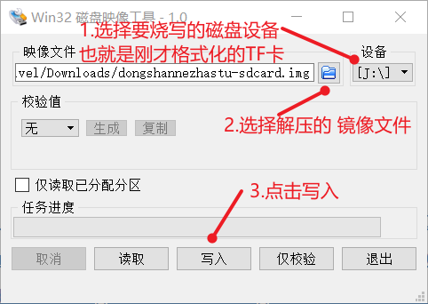

完成以后，就可以弹出TF卡，并将其插到 东山哪吒STU 最小板背面的TF卡槽位置处，此时连接 串口线 并使用 串口工具打开串口设备，按下开发板的 **RESET**复位按键就可以重启进入TF卡系统内了。

* 使用 etcher https://etcher.balena.io/ 工具直接烧写系统镜像。

1.以管理员身份运行 etcher 烧写工具

2.选择需要烧写的系统镜像文件

3.选择 目标磁盘，找到TF卡设备

4. 点击烧录，等待烧录成功

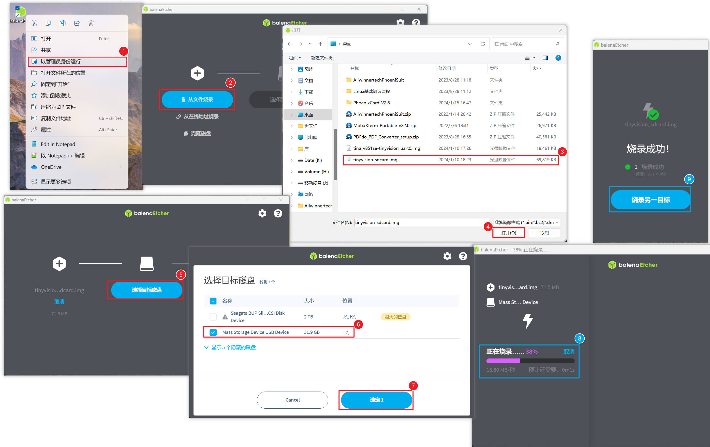

### Debian12

- tinyvision_debian12_sdcard.img
  - 支持 debian 12发行版系统

### Buildroot-2023

- tinyvision_sdcard.img
  - 使用Linux kernel 5.15构建
  - 配套 buildroot 2023版本
  - 使用 syster启动

### OpenWrt-23.05

- openwrt-yuzukihd-v851se-yuzuki_tinyvision-ext4-sysupgrade.img
  - 使用Linux kernel 6.x构建
  - 支持WOL
  - 支持LUCI配置
  - 支持百兆网卡等

# 支持的系统与开发 SDK

### Tina-SDK系统

- 此套构建系统基于全志单核 Arm Cortex-A7 SoC，搭载了 RISC-V 内核的V851s 芯片，适配了Tina 5.0主线版本，是专为智能 IP 摄像机设计的，支持人体检测和穿越报警等功能。

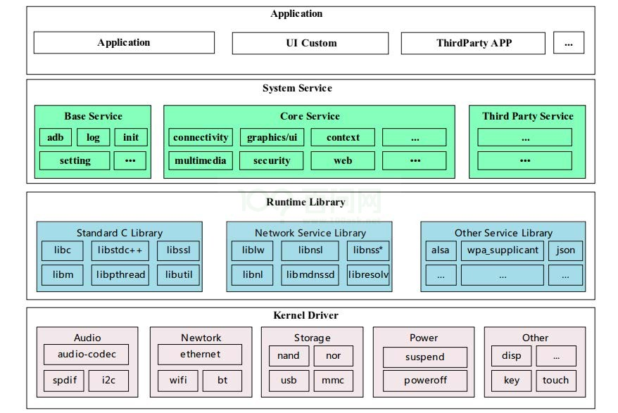

* SDK 下载解压操作步骤请参考  Tina-SDK开发章节内容。
* TinaSDK开发参考文档站点 https://tina.100ask.net/
  * 第一部分介绍了Tina-SDK源码的使用方式，包含源码目录功能，编译打包等命令。
  * 第二部分介绍了Bootloader相关的内容，主要包含uboot相关的使用说明。
  * 第三部分介绍了Linux所有的设备驱动开发的详细说明。
  * 第四部分介绍了Linux驱动之上的各类组件包库等的开发说明。
  * 第五部分介绍了Linux系统的相关操作，主要包含存储支持 打包 调试 优化等
  * 第六部分支持了一些应用demo示例，如LVGL GST等常用且较为丰富的综合项目

### SyterKit系统

* SyterKit源码位置:   https://github.com/YuzukiHD/SyterKit

SyterKit 是一个纯裸机框架，用于 TinyVision 或者其他 v851se/v851s/v851s3/v853 等芯片的开发板，SyterKit 使用 CMake 作为构建系统构建，支持多种应用与多种外设驱动。同时 SyterKit 也具有启动引导的功能，可以替代 U-Boot 实现快速启动（标准 Linux6.7 主线启动时间 1.02s，相较于传统 U-Boot 启动快 3s）。

目前已经支持如下功能

| 名称            | 功能                                                         | 路径                  |
| --------------- | ------------------------------------------------------------ | --------------------- |
| hello world     | 最小程序示例，打印 Hello World                               | `app/hello_world`     |
| init dram       | 初始化串行端口和 DRAM                                        | `app/init_dram`       |
| read chip efuse | 读取芯片 efuse 信息                                          | `app/read_chip_efuse` |
| read chipsid    | 读取芯片的唯一 ID                                            | `app/read_chipsid`    |
| load e907       | 读取 e907 核心固件，启动 e907 核心，并使用 V851s 作为大型 RISC-V 微控制器（E907 @ 600 MHz，64MB 内存） | `app/load_e907`       |
| syter boot      | 替代 U-Boot 的引导函数，为 Linux 启用快速系统启动            | `app/syter_boot`      |
| syter amp       | 读取 e907 核心固件，启动 e907 核心，加载内核，并在 e907 和 a7 系统上同时运行 Linux，系统是异构集成运行的 | `app/syter_amp`       |
| fdt parser      | 读取设备树二进制文件并解析打印输出                           | `app/fdt_parser`      |
| fdt cli         | 使用支持 uboot fdt 命令的 CLI 读取设备树二进制文件           | `app/fdt_cli`         |
| syter bootargs  | 替代 U-Boot 引导，为 Linux 启用快速系统启动，支持在 CLI 中更改启动参数 | `app/syter_bootargs`  |
| cli test        | 测试基本 CLI 功能                                            | `app/cli_test`        |

### Linux Kernel

基于Linus主线LinuxKernel 支持 tinyvision单板及驱动模块，支持多个内核版本，不同的内核版本支持的功能特性也不同，可以通过下述列表查看。

* 源码所在位置  https://github.com/YuzukiHD/TinyVision/tree/main/kernel/

| Kernel Version     | Target ON                               | Core           | Path                |
| ------------------ | --------------------------------------- | -------------- | ------------------- |
| 4.9.191            | CV, Camera, NPU, MP, Video Encode, RTSP | Cortex-A7 Core | `kernel\linux-4.9`  |
| 5.15.y             | IoT, NPU, Router                        | Cortex-A7 Core | `kernel\linux-5.15` |
| 6.1.y              | IoT                                     | Cortex-A7 Core | `kernel\linux-6.1`  |
| Mainline Linux 6.7 | Mainline                                | Cortex-A7 Core | `kernel\linux-6.7`  |


### RTOS Kernel 

| Kernel Version | Target ON               | Core           | Path              |
| -------------- | ----------------------- | -------------- | ----------------- |
| RT-Thread      | Real-Time Control, Fast | RISC-V E907    | `kernel\rtos`     |
| SyterKit       | Baremetal ASM Code      | Cortex-A7 Core | `kernel\SyterKit` |

### Openwrt系统

TinyVision自带百兆网口接口+摄像头接口支持，支持 Current stable series: OpenWrt 23.05 系统，可以做一个 轻量级的IPC摄像头，里面运行主线系统，选择合适的内核版本  一键 编译生成系统镜像。

* openwrt-23.05源码:   https://github.com/YuzukiHD/OpenWrt/tree/openwrt-23.05
* OpenWrt-23.05目录结构，OpenWrt-23.05.tar.gz 压缩包 md5值 2b10a86405aa4d045bc2134e98d3f6d8 请确保压缩包文件一致性。

``` bash
ubuntu@ubuntu1804:~/$ md5sum OpenWrt-23.05.tar.gz 
ubuntu@ubuntu1804:~/$ tree -L 1
.
├── bin
├── BSDmakefile
├── build_dir
├── config
├── Config.in
├── COPYING
├── dl
├── feeds
├── feeds.conf.default
├── include
├── key-build
├── key-build.pub
├── key-build.ucert
├── key-build.ucert.revoke
├── LICENSES
├── Makefile
├── package
├── README.md
├── rules.mk
├── scripts
├── staging_dir
├── target
├── tmp
├── toolchain
└── tools

14 directories, 11 files

```

### Buildroot系统

buildroot系统是一套基于Makefile管理的构建系统框架

* buildroot-2023.2:  https://github.com/DongshanPI/buildroot-external-tinyvision

``` ba
ubuntu@ubuntu1804:~/buildroot-2023.02.8$ tree -L 1
.
├── arch
├── board
├── boot
├── CHANGES
├── Config.in
├── Config.in.legacy
├── configs
├── COPYING
├── defconfig
├── DEVELOPERS
├── dl
├── docs
├── fs
├── linux
├── Makefile
├── Makefile.legacy
├── output
├── package
├── README
├── support
├── system
├── toolchain
└── utils

15 directories, 9 files
ubuntu@ubuntu1804:~/buildroot-2023.02.8$ 
```

# 安装并配置开发环境


## 获取虚拟机系统

### 下载vmware虚拟机工具

使用浏览器打开网址    https://www.vmware.com/products/workstation-pro/workstation-pro-evaluation.html   参考下图箭头所示，点击下载安装 Windows版本的VMware Workstation ，点击 **DOWNLOAD NOW**  即可开始下载。


下载完成后全部使用默认配置一步步安装即可。


### 获取Ubuntu系统镜像

* 使用浏览器打开  https://www.linuxvmimages.com/images/ubuntu-1804/     找到如下箭头所示位置，点击 **VMware Image** 下载。

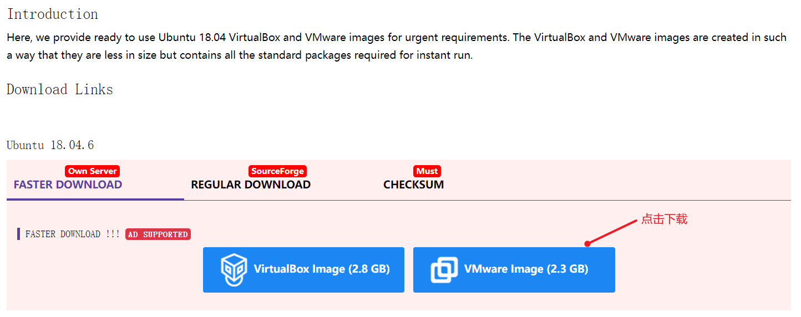

下载过程可能会持续 10 到 30 分钟，具体要依据网速而定。


## 运行虚拟机系统

1. 解压缩 虚拟机系统镜像压缩包，解压缩完成后，可以看到里面有如下两个文件，接下来，我们会使用 后缀名为 .vmx 这个 配置文件。

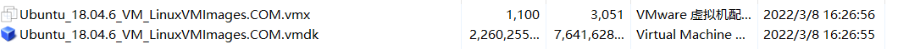

2.  打开已经安装好的 vmware workstation 软件 点击左上角的 **文件** --> **打开** 找到上面的 Ubuntu_18.04.6_VM_LinuxVMImages.COM.vmx  文件，之后会弹出新的虚拟机对话框页面。

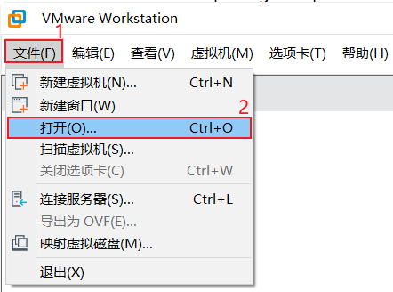

3. 如下图所示为  为我们已经虚拟机的配置界面，那面我们可以 点击 红框 2 编辑虚拟机设置 里面 去调正 我们虚拟机的 内存 大小 和处理器个数，建议 最好 内存为 4GB 及以上，处理器至少4 个。 调整好以后，就可以 点击 **开启此虚拟机** 来运行此虚拟机了

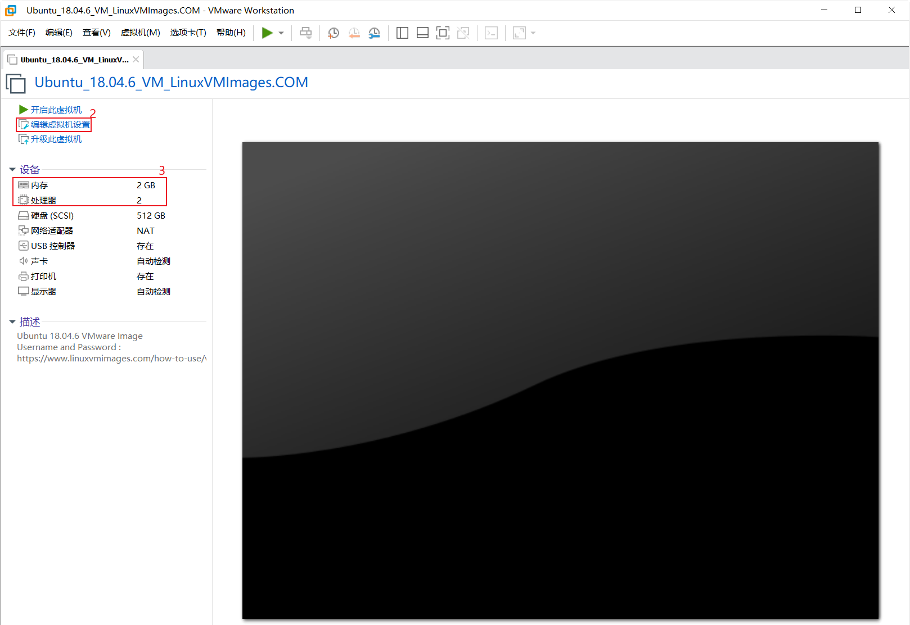

第一次打开会提示  一个 虚拟机已经复制的 对话框，我们这时，只需要 点击  我已复制虚拟机  就可以继续启动虚拟机系统了。

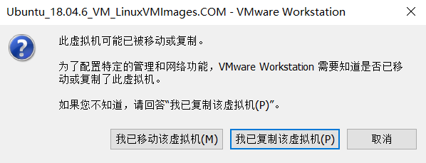

等待数秒，系统就会自动启动了，启动以后 鼠标点击   **Ubuntu**  字样，就可以进入登录对话框，输入  密码 ubuntu 即可登录进入ubuntu系统内。

注意： 

**Ubuntu默认的用户名密码分别为 ubuntu ubuntu** 

**Ubuntu默认的用户名密码分别为 ubuntu ubuntu** 

**Ubuntu默认的用户名密码分别为 ubuntu ubuntu** 

**ubuntu默认需要联网，如果你的 Windows电脑已经可以访问Internet 互联网，ubuntu系统后就会自动共享 Windows电脑的网络 进行连接internet 网络。**


### 配置开发环境

* 安装必要软件包, 鼠标点击进入 ubuntu界面内，键盘同时 按下 **ctrl + alt + t** 三个按键会快速唤起，终端界面，唤起成功后，在终端里面执行如下命令进行安装必要依赖包。

```bash
sudo apt-get install -y  sed make binutils build-essential  gcc g++ bash patch gzip bzip2 perl  tar cpio unzip rsync file  bc wget python  cvs git mercurial rsync  subversion android-tools-mkbootimg vim  libssl-dev  android-tools-fastboot
```

如果你发现你的ubuntu虚拟机 第一次启动 无法 通过 windows下复制 命令 粘贴到 ubuntu内，则需要先手敲 执行如下命令 安装一个 用于 虚拟机和 windows共享剪切板的工具包。

```bash
sudo apt install open-vm-tools-desktop 
```

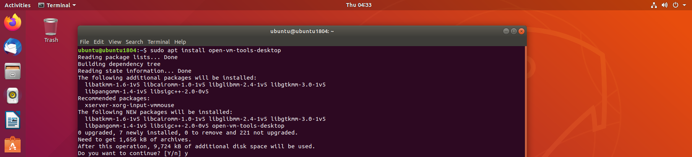

安装完成后，点击右上角的 电源按钮，重启ubuntu系统，或者 直接输入 sudo reboot 命令进行重启。

这时就可以 通过windows端向ubuntu内粘贴文件，或者拷贝拷出文件了。

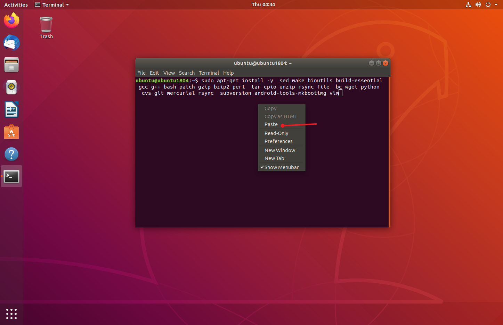

做完这一步以后，就可以继续往下，进行开发了。

# Tina Linux 开发

AWOL 版本的 Tina Linux 使用的是 Tina5.0，OpenWrt 升级到了 21.05 版本，相较于商业量产版本的 Tina Linux 新了许多，而且支持更多新软件包。不过可惜的是 MPP 没有移植到 Tina5.0，不过 MPP 使用门槛较高，学习难度大，不是做产品也没必要研究。这里就研究下使用 AWOL 开源版本的 Tina Linux 与 OpenCV 框架开启摄像头拍照捕获视频。

## 准备开发环境

首先准备一台 Ubuntu 20.04 / Ubuntu 18.04 / Ubuntu 16.04 / Ubuntu 14.04 的虚拟机或实体机，其他系统没有测试过出 BUG 不管。

更新系统，安装基础软件包

```
sudo apt-get update
sudo apt-get upgrade -y
sudo apt-get install build-essential subversion git libncurses5-dev zlib1g-dev gawk flex bison quilt libssl-dev xsltproc libxml-parser-perl mercurial bzr ecj cvs unzip lsof python3 python2 python3-dev android-tools-mkbootimg python2 libpython3-dev
```

安装完成后还需要安装 i386 支持，SDK 有几个打包固件使用的程序是 32 位的，如果不安装就等着 `Segment fault` 吧。

```
sudo dpkg --add-architecture i386
sudo apt-get update
sudo apt install gcc-multilib 
sudo apt install libc6:i386 libstdc++6:i386 lib32z1
```

## 下载 AWOL Tina Linux BSP

### 注册一个 AWOL 账号

下载 SDK 需要使用 AWOL 的账号，前往 `https://bbs.aw-ol.com/` 注册一个就行。其中需要账号等级为 LV2，可以去这个帖子：https://bbs.aw-ol.com/topic/4158/share/1 水四条回复就有 LV2 等级了。

### 安装 repo 管理器

BSP 使用 `repo` 下载，首先安装 `repo `，这里建议使用国内镜像源安装

```bash
mkdir -p ~/.bin
PATH="${HOME}/.bin:${PATH}"
curl https://mirrors.bfsu.edu.cn/git/git-repo > ~/.bin/repo
chmod a+rx ~/.bin/repo
```

请注意这里使用的是临时安装，安装完成后重启终端就没有了，需要再次运行下面的命令才能使用，如何永久安装请自行百度。

```bash
PATH="${HOME}/.bin:${PATH}"
```

安装使用 `repo` 的过程中会遇到各种错误，请百度解决。repo 是谷歌开发的，repo 的官方服务器是谷歌的服务器，repo 每次运行时需要检查更新然后卡死，这是很正常的情况，所以在国内需要更换镜像源提高下载速度。将如下内容复制到你的`~/.bashrc` 里

```bash
echo export REPO_URL='https://mirrors.bfsu.edu.cn/git/git-repo' >> ~/.bashrc
source ~/.bashrc
```

如果您使用的是 dash、hash、 zsh 等 shell，请参照 shell 的文档配置。环境变量配置一个 `REPO_URL` 的地址

配置一下 git 身份认证，设置保存 git 账号密码不用每次都输入。

```bash
git config --global credential.helper store
```

### 新建文件夹保存 SDK

使用 `mkdir` 命令新建文件夹，保存之后需要拉取的 SDK，然后 `cd` 进入到刚才新建的文件夹中。

```bash
mkdir tina-v853-open
cd tina-v853-open
```

### 初始化 repo 仓库

使用 `repo init` 命令初始化仓库，`tina-v853-open` 的仓库地址是 `https://sdk.aw-ol.com/git_repo/V853Tina_Open/manifest.git` 需要执行命令：

```bash
repo init -u https://sdk.aw-ol.com/git_repo/V853Tina_Open/manifest.git -b master -m tina-v853-open.xml
```

### 拉取 SDK

```bash
repo sync
```

### 创建开发环境

```bash
repo start devboard-v853-tina-for-awol --all
```

## 适配 TinyVision 板子

刚才下载到的 SDK 只支持一个板子，售价 1999 的 `V853-Vision`  开发板，这里要添加自己的板子的适配。

下载支持包：https://github.com/YuzukiTsuru/YuzukiTsuru.GitHub.io/releases/download/2024-01-21-20240121/tina-bsp-tinyvision.tar.gz

或者可以在：https://github.com/YuzukiHD/TinyVision/tree/main/tina 下载到文件，不过这部分没预先下载软件包到 dl 文件夹所以编译的时候需要手动下载。

放到 SDK 的主目录下

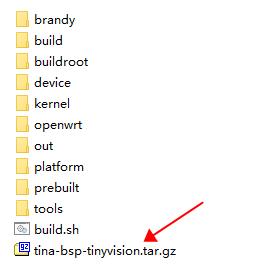

运行解压指令

``` bash
tar xvf tina-bsp-tinyvision.tar.gz
```

即可使 Tina SDK 支持 TinyVision 板子


## 初始化 SDK 环境

每次开发之前都需要初始化 SDK 环境，命令如下

```
source build/envsetup.sh
```

然后按 1 选择 TinyVision

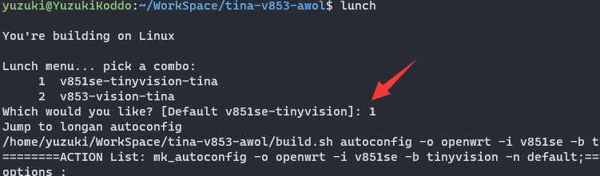

## 适配 ISP 

Tina SDK 内置一个 libAWispApi 的包，支持在用户层对接 ISP，但是很可惜这个包没有适配 V85x 系列，这里就需要自行适配。其实适配很简单，SDK 已经提供了 lib 只是没提供编译支持。我们需要加上这个支持。

前往 `openwrt/package/allwinner/vision/libAWIspApi/machinfo` 文件夹中，新建一个文件夹 `v851se` ，然后新建文件 `build.mk` 写入如下配置：

``` 
ISP_DIR:=isp600
```

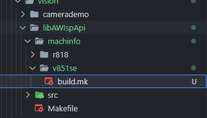

对于  v851s，v853 也可以这样操作，然后 `m menuconfig` 勾选上这个包

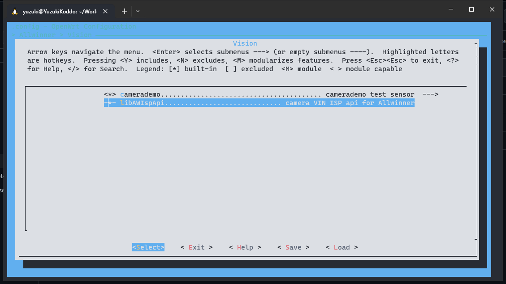

## 开启 camerademo 测试摄像头

进入 `m menuconfig` 进入如下页面进行配置。

```
Allwinner  --->
	Vision  --->
		<*> camerademo........................................ camerademo test sensor  --->
			[*]   Enabel vin isp support
```

编译系统然后烧录系统，运行命令 `camerademo` ，可以看到是正常拍摄照片的

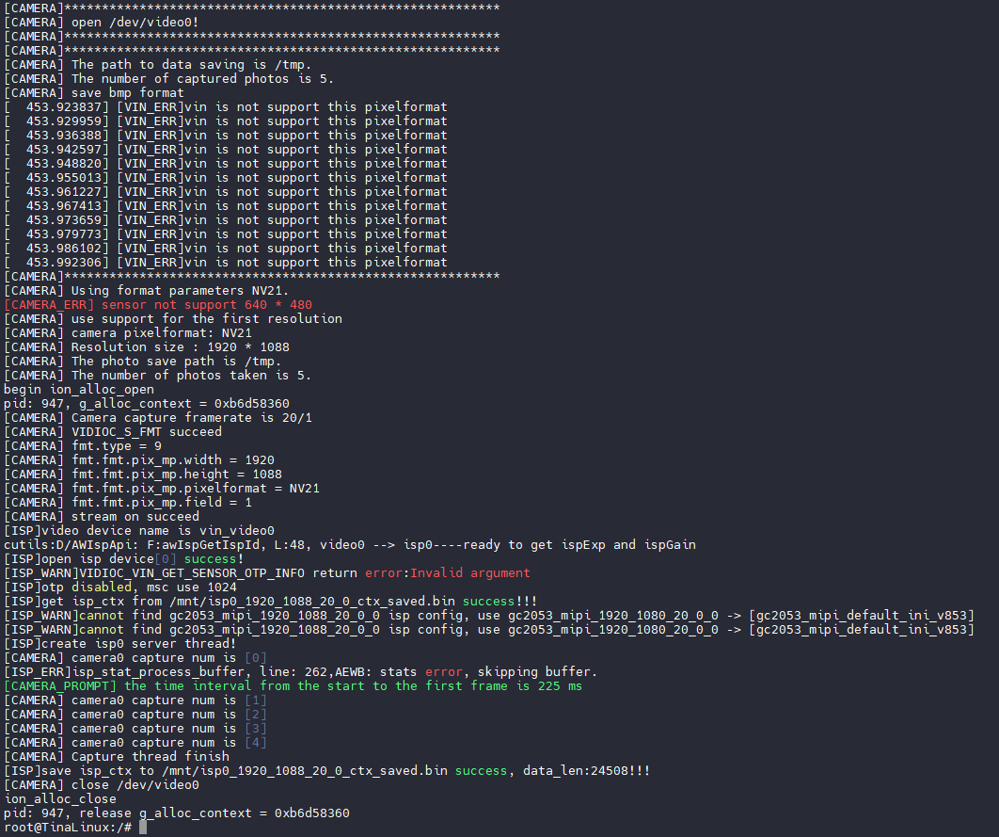

## 适配 OpenCV 

### 勾选 OpenCV 包

`m menuconfig` 进入软件包配置，勾选 

```
OpenCV  --->
	<*> opencv....................................................... opencv libs
	[*]   Enabel sunxi vin isp support
```

### OpenCV 适配过程

**本部分的操作已经包含在 tina-bsp-tinyvision.tar.gz 中了，已经适配好了，如果不想了解如何适配 OpenCV 可以直接跳过这部分**

#### OpenCV 的多平面视频捕获支持

一般来说，如果不适配 OpenCV 直接开摄像头，会得到一个报错：

```
[  702.464977] [VIN_ERR]video0 has already stream off
[  702.473357] [VIN_ERR]gc2053_mipi is not used, video0 cannot be close!
VIDEOIO ERROR: V4L2: Unable to capture video memory.VIDEOIO ERROR: V4L: can't open camera by index 0
/dev/video0 does not support memory mapping
Could not open video device.
```

这是由于 OpenCV 的 V4L2 实现是使用的 `V4L2_CAP_VIDEO_CAPTURE` 标准，而 `sunxi-vin` 驱动的 RAW Sensor 平台使用的是 `V4L2_BUF_TYPE_VIDEO_CAPTURE_MPLANE` ，导致了默认 OpenCV 的配置错误。

`V4L2_CAP_VIDEO_CAPTURE_MPLANE`和`V4L2_BUF_TYPE_VIDEO_CAPTURE`是 Video4Linux2（V4L2）框架中用于视频捕获的不同类型和能力标志。

1. `V4L2_CAP_VIDEO_CAPTURE_MPLANE`： 这个标志指示设备支持多平面（multi-plane）视频捕获。在多平面捕获中，图像数据可以分解成多个平面（planes），每个平面包含不同的颜色分量或者图像数据的不同部分。这种方式可以提高效率和灵活性，尤其适用于处理涉及多个颜色分量或者多个图像通道的视频流。
2. `V4L2_BUF_TYPE_VIDEO_CAPTURE`： 这个类型表示普通的单平面（single-plane）视频捕获。在单平面捕获中，图像数据以单个平面的形式存储，即所有的颜色分量或者图像数据都保存在一个平面中。

因此，区别在于支持的数据格式和存储方式。`V4L2_CAP_VIDEO_CAPTURE_MPLANE`表示设备支持多平面视频捕获，而`V4L2_BUF_TYPE_VIDEO_CAPTURE`表示普通的单平面视频捕获。

这里就需要通过检查`capability.capabilities`中是否包含`V4L2_CAP_VIDEO_CAPTURE`标志来确定是否支持普通的视频捕获类型。如果支持，那么将`type`设置为`V4L2_BUF_TYPE_VIDEO_CAPTURE`。

如果不支持普通的视频捕获类型，那么通过检查`capability.capabilities`中是否包含`V4L2_CAP_VIDEO_CAPTURE_MPLANE`标志来确定是否支持多平面视频捕获类型。如果支持，那么将`type`设置为`V4L2_BUF_TYPE_VIDEO_CAPTURE_MPLANE`。

例如如下修改：

```diff
-    form.type                = V4L2_BUF_TYPE_VIDEO_CAPTURE;
-    form.fmt.pix.pixelformat = palette;
-    form.fmt.pix.field       = V4L2_FIELD_ANY;
-    form.fmt.pix.width       = width;
-    form.fmt.pix.height      = height;
+    if (capability.capabilities & V4L2_CAP_VIDEO_CAPTURE) {
+		form.type                = V4L2_BUF_TYPE_VIDEO_CAPTURE;
+		form.fmt.pix.pixelformat = palette;
+		form.fmt.pix.field       = V4L2_FIELD_NONE;
+		form.fmt.pix.width       = width;
+		form.fmt.pix.height      = height;
+	} else if (capability.capabilities & V4L2_CAP_VIDEO_CAPTURE_MPLANE) {
+        form.type = V4L2_BUF_TYPE_VIDEO_CAPTURE_MPLANE;
+        form.fmt.pix_mp.width = width;
+        form.fmt.pix_mp.height = height;
+        form.fmt.pix_mp.pixelformat = palette;
+        form.fmt.pix_mp.field = V4L2_FIELD_NONE;
+	}
```

这段代码是在设置视频捕获的格式和参数时进行了修改。

原来的代码中，直接设置了`form.type`为`V4L2_BUF_TYPE_VIDEO_CAPTURE`，表示使用普通的视频捕获类型。然后设置了其他参数，如像素格式(`pixelformat`)、帧字段(`field`)、宽度(`width`)和高度(`height`)等。

修改后的代码进行了条件判断，根据设备的能力选择合适的视频捕获类型。如果设备支持普通的视频捕获类型（`V4L2_CAP_VIDEO_CAPTURE`标志被设置），则使用普通的视频捕获类型并设置相应的参数。如果设备支持多平面视频捕获类型（`V4L2_CAP_VIDEO_CAPTURE_MPLANE`标志被设置），则使用多平面视频捕获类型并设置相应的参数。

对于普通的视频捕获类型，设置的参数与原来的代码一致，只是将帧字段(`field`)从`V4L2_FIELD_ANY`改为`V4L2_FIELD_NONE`，表示不指定特定的帧字段。

对于多平面视频捕获类型，设置了新的参数，如多平面的宽度(`pix_mp.width`)、高度(`pix_mp.height`)、像素格式(`pix_mp.pixelformat`)和帧字段(`pix_mp.field`)等。

通过这个修改，可以根据设备的能力选择适当的视频捕获类型，并设置相应的参数，以满足不同设备的要求。

#### OpenCV 的 ISP 支持

OpenCV 默认不支持开启 RAW Sensor，不过现在需要配置为 OpenCV 开启 RAW Sensor 抓图，然后通过 OpenCV 送图到之前适配的 libAWispApi 库进行 ISP 处理。在这里增加一个函数作为 RAW Sensor 抓图的处理。

```c++
#ifdef __USE_VIN_ISP__
bool CvCaptureCAM_V4L::RAWSensor()
{
    struct v4l2_control ctrl;
    struct v4l2_queryctrl qc_ctrl;

    memset(&ctrl, 0, sizeof(struct v4l2_control));
    memset(&qc_ctrl, 0, sizeof(struct v4l2_queryctrl));
    ctrl.id = V4L2_CID_SENSOR_TYPE;
    qc_ctrl.id = V4L2_CID_SENSOR_TYPE;

    if (-1 == ioctl (deviceHandle, VIDIOC_QUERYCTRL, &qc_ctrl)){
        fprintf(stderr, "V4L2: %s QUERY V4L2_CID_SENSOR_TYPE failed\n", deviceName.c_str());
        return false;
    }

    if (-1 == ioctl(deviceHandle, VIDIOC_G_CTRL, &ctrl)) {
        fprintf(stderr, "V4L2: %s G_CTRL V4L2_CID_SENSOR_TYPE failed\n", deviceName.c_str());
        return false;
    }

    return ctrl.value == V4L2_SENSOR_TYPE_RAW;
}
#endif
```

这段代码的功能是检查V4L2摄像头设备的传感器类型是否为RAW格式。它使用了V4L2的ioctl函数来查询和获取传感器类型信息。具体步骤如下：

1. 定义了两个v4l2_control结构体变量`ctrl`和`qc_ctrl`，并初始化为零
2. 将`ctrl.id`和`qc_ctrl.id`分别设置为`V4L2_CID_SENSOR_TYPE`，表示要查询的控制和查询ID
3. 使用`ioctl`函数的VIDIOC_QUERYCTRL命令来查询传感器类型的控制信息，并将结果保存在`qc_ctrl`中
4. 如果查询失败（`ioctl`返回-1），则输出错误信息并返回false
5. 使用`ioctl`函数的VIDIOC_G_CTRL命令来获取传感器类型的当前值，并将结果保存在`ctrl`中
6. 如果获取失败（`ioctl`返回-1），则输出错误信息并返回false
7. 检查`ctrl.value`是否等于`V4L2_SENSOR_TYPE_RAW`，如果相等，则返回true，表示传感器类型为RAW格式；否则返回false

并且使用了`#ifdef __USE_VIN_ISP__`指令。这表示只有在定义了`__USE_VIN_ISP__`宏时，才会编译和执行这段代码

然后在 OpenCV 的 ` bool CvCaptureCAM_V4L::streaming(bool startStream)` 捕获流函数中添加 ISP 处理

```c++
#ifdef __USE_VIN_ISP__
	RawSensor = RAWSensor();

	if (startStream && RawSensor) {
		int VideoIndex = -1;

		sscanf(deviceName.c_str(), "/dev/video%d", &VideoIndex);

		IspPort = CreateAWIspApi();
		IspId = -1;
		IspId = IspPort->ispGetIspId(VideoIndex);
		if (IspId >= 0)
			IspPort->ispStart(IspId);
	} else if (RawSensor && IspId >= 0 && IspPort) {
		IspPort->ispStop(IspId);
		DestroyAWIspApi(IspPort);
		IspPort = NULL;
		IspId = -1;
	}
#endif
```

这段代码是在条件编译`__USE_VIN_ISP__`的情况下进行了修改。

- 首先，它创建了一个`RawSensor`对象，并检查`startStream`和`RawSensor`是否为真。如果满足条件，接下来会解析设备名称字符串，提取出视频索引号。

- 然后，它调用`CreateAWIspApi()`函数创建了一个AWIspApi对象，并初始化变量`IspId`为-1。接着，通过调用`ispGetIspId()`函数获取指定视频索引号对应的ISP ID，并将其赋值给`IspId`。如果`IspId`大于等于0，表示获取到有效的ISP ID，就调用`ispStart()`函数启动ISP流处理。

- 如果不满足第一个条件，即`startStream`为假或者没有`RawSensor`对象，那么会检查`IspId`是否大于等于0并且`IspPort`对象是否存在。如果满足这些条件，说明之前已经启动了ISP流处理，此时会调用`ispStop()`函数停止ISP流处理，并销毁`IspPort`对象。最后，将`IspPort`置为空指针，将`IspId`重置为-1。

这段代码主要用于控制图像信号处理（ISP）的启动和停止。根据条件的不同，可以选择在开始视频流捕获时启动ISP流处理，或者在停止视频流捕获时停止ISP流处理，以便对视频数据进行处理和增强。

至于其他包括编译脚本的修改，全局变量定义等操作，可以参考补丁文件 `openwrt/package/thirdparty/vision/opencv/patches/0004-support-sunxi-vin-camera.patch` 

## 使用 OpenCV 捕获摄像头并且输出到屏幕上

### 快速测试

这个 DEMO 也已经包含在 tina-bsp-tinyvision.tar.gz 中了，可以快速测试这个 DEMO

运行 `m menuconfig`

```
OpenCV  --->
	<*> opencv....................................................... opencv libs
	[*]   Enabel sunxi vin isp support
	<*> opencv_camera.............................opencv_camera and display image
```

### 源码详解

编写一个程序，使用 OpenCV 捕获摄像头输出并且显示到屏幕上，程序如下：

```c++
#include <fcntl.h>
#include <fstream>
#include <iostream>
#include <linux/fb.h>
#include <signal.h>
#include <stdint.h>
#include <sys/ioctl.h>

#include <opencv2/opencv.hpp>

#define DISPLAY_X 240
#define DISPLAY_Y 240

static cv::VideoCapture cap;

struct framebuffer_info {
    uint32_t bits_per_pixel;
    uint32_t xres_virtual;
};

struct framebuffer_info get_framebuffer_info(const char* framebuffer_device_path)
{
    struct framebuffer_info info;
    struct fb_var_screeninfo screen_info;
    int fd = -1;
    fd = open(framebuffer_device_path, O_RDWR);
    if (fd >= 0) {
        if (!ioctl(fd, FBIOGET_VSCREENINFO, &screen_info)) {
            info.xres_virtual = screen_info.xres_virtual;
            info.bits_per_pixel = screen_info.bits_per_pixel;
        }
    }
    return info;
};

/* Signal handler */
static void terminate(int sig_no)
{
    printf("Got signal %d, exiting ...\n", sig_no);
    cap.release();
    exit(1);
}

static void install_sig_handler(void)
{
    signal(SIGBUS, terminate);
    signal(SIGFPE, terminate);
    signal(SIGHUP, terminate);
    signal(SIGILL, terminate);
    signal(SIGINT, terminate);
    signal(SIGIOT, terminate);
    signal(SIGPIPE, terminate);
    signal(SIGQUIT, terminate);
    signal(SIGSEGV, terminate);
    signal(SIGSYS, terminate);
    signal(SIGTERM, terminate);
    signal(SIGTRAP, terminate);
    signal(SIGUSR1, terminate);
    signal(SIGUSR2, terminate);
}

int main(int, char**)
{
    const int frame_width = 480;
    const int frame_height = 480;
    const int frame_rate = 30;

    install_sig_handler();

    framebuffer_info fb_info = get_framebuffer_info("/dev/fb0");

    cap.open(0);

    if (!cap.isOpened()) {
        std::cerr << "Could not open video device." << std::endl;
        return 1;
    }

    std::cout << "Successfully opened video device." << std::endl;
    cap.set(cv::CAP_PROP_FRAME_WIDTH, frame_width);
    cap.set(cv::CAP_PROP_FRAME_HEIGHT, frame_height);
    cap.set(cv::CAP_PROP_FPS, frame_rate);

    std::ofstream ofs("/dev/fb0");

    cv::Mat frame;
    cv::Mat trams_temp_fream;
    cv::Mat yuv_frame;

    while (true) {
        cap >> frame;
        if (frame.depth() != CV_8U) {
            std::cerr << "Not 8 bits per pixel and channel." << std::endl;
        } else if (frame.channels() != 3) {
            std::cerr << "Not 3 channels." << std::endl;
        } else {
            cv::transpose(frame, frame);
            cv::flip(frame, frame, 0);
            cv::resize(frame, frame, cv::Size(DISPLAY_X, DISPLAY_Y));
            int framebuffer_width = fb_info.xres_virtual;
            int framebuffer_depth = fb_info.bits_per_pixel;
            cv::Size2f frame_size = frame.size();
            cv::Mat framebuffer_compat;
            switch (framebuffer_depth) {
            case 16:
                cv::cvtColor(frame, framebuffer_compat, cv::COLOR_BGR2BGR565);
                for (int y = 0; y < frame_size.height; y++) {
                    ofs.seekp(y * framebuffer_width * 2);
                    ofs.write(reinterpret_cast<char*>(framebuffer_compat.ptr(y)), frame_size.width * 2);
                }
                break;
            case 32: {
                std::vector<cv::Mat> split_bgr;
                cv::split(frame, split_bgr);
                split_bgr.push_back(cv::Mat(frame_size, CV_8UC1, cv::Scalar(255)));
                cv::merge(split_bgr, framebuffer_compat);
                for (int y = 0; y < frame_size.height; y++) {
                    ofs.seekp(y * framebuffer_width * 4);
                    ofs.write(reinterpret_cast<char*>(framebuffer_compat.ptr(y)), frame_size.width * 4);
                }
            } break;
            default:
                std::cerr << "Unsupported depth of framebuffer." << std::endl;
            }
        }
    }
}
```

第一部分，处理 frame_buffer 信息：

```c++
// 引入头文件
#include <fcntl.h>
#include <fstream>
#include <iostream>
#include <linux/fb.h>
#include <signal.h>
#include <stdint.h>
#include <sys/ioctl.h>

#include <opencv2/opencv.hpp>

// 定义显示屏宽度和高度
#define DISPLAY_X 240
#define DISPLAY_Y 240

static cv::VideoCapture cap; // 视频流捕获对象

// 帧缓冲信息结构体
struct framebuffer_info {
    uint32_t bits_per_pixel; // 每个像素的位数
    uint32_t xres_virtual; // 虚拟屏幕的宽度
};

// 获取帧缓冲信息函数
struct framebuffer_info get_framebuffer_info(const char* framebuffer_device_path)
{
    struct framebuffer_info info;
    struct fb_var_screeninfo screen_info;
    int fd = -1;

    // 打开帧缓冲设备文件
    fd = open(framebuffer_device_path, O_RDWR);
    if (fd >= 0) {
        // 通过 ioctl 获取屏幕信息
        if (!ioctl(fd, FBIOGET_VSCREENINFO, &screen_info)) {
            info.xres_virtual = screen_info.xres_virtual; // 虚拟屏幕的宽度
            info.bits_per_pixel = screen_info.bits_per_pixel; // 每个像素的位数
        }
    }
    return info;
}
```

这段代码定义了一些常量、全局变量以及两个函数，并给出了相应的注释说明。具体注释如下：

- `#define DISPLAY_X 240`：定义显示屏的宽度为240。
- `#define DISPLAY_Y 240`：定义显示屏的高度为240。
- `static cv::VideoCapture cap;`：定义一个静态的OpenCV视频流捕获对象，用于捕获视频流。
- `struct framebuffer_info`：定义了一个帧缓冲信息的结构体。
  - `uint32_t bits_per_pixel`：每个像素的位数。
  - `uint32_t xres_virtual`：虚拟屏幕的宽度。
- `struct framebuffer_info get_framebuffer_info(const char* framebuffer_device_path)`：获取帧缓冲信息的函数。
  - `const char* framebuffer_device_path`：帧缓冲设备文件的路径。
  - `int fd = -1;`：初始化文件描述符为-1。
  - `fd = open(framebuffer_device_path, O_RDWR);`：打开帧缓冲设备文件，并将文件描述符保存在变量`fd`中。
  - `if (fd >= 0)`：检查文件是否成功打开。
  - `if (!ioctl(fd, FBIOGET_VSCREENINFO, &screen_info))`：通过ioctl获取屏幕信息，并将信息保存在变量`screen_info`中。
    - `FBIOGET_VSCREENINFO`：控制命令，用于获取屏幕信息。
    - `&screen_info`：屏幕信息结构体的指针。
  - `info.xres_virtual = screen_info.xres_virtual;`：将屏幕的虚拟宽度保存在帧缓冲信息结构体的字段`xres_virtual`中。
  - `info.bits_per_pixel = screen_info.bits_per_pixel;`：将每个像素的位数保存在帧缓冲信息结构体的字段`bits_per_pixel`中。
  - `return info;`：返回帧缓冲信息结构体。

第二部分，注册信号处理函数，用于 `ctrl-c` 之后关闭摄像头，防止下一次使用摄像头出现摄像头仍被占用的情况。

```c++
/* Signal handler */
static void terminate(int sig_no)
{
    printf("Got signal %d, exiting ...\n", sig_no);
    cap.release();
    exit(1);
}

static void install_sig_handler(void)
{
    signal(SIGBUS, terminate); // 当程序访问一个不合法的内存地址时发送的信号
    signal(SIGFPE, terminate); // 浮点异常信号
    signal(SIGHUP, terminate); // 终端断开连接信号
    signal(SIGILL, terminate); // 非法指令信号
    signal(SIGINT, terminate); // 中断进程信号
    signal(SIGIOT, terminate); // IOT 陷阱信号
    signal(SIGPIPE, terminate); // 管道破裂信号
    signal(SIGQUIT, terminate); // 停止进程信号
    signal(SIGSEGV, terminate); // 无效的内存引用信号
    signal(SIGSYS, terminate); // 非法系统调用信号
    signal(SIGTERM, terminate); // 终止进程信号
    signal(SIGTRAP, terminate); // 跟踪/断点陷阱信号
    signal(SIGUSR1, terminate); // 用户定义信号1
    signal(SIGUSR2, terminate); // 用户定义信号2
}
```

这段代码定义了两个函数，并给出了相应的注释说明。具体注释如下：

- `static void terminate(int sig_no)`：信号处理函数。
  - `int sig_no`：接收到的信号编号。
  - `printf("Got signal %d, exiting ...\n", sig_no);`：打印接收到的信号编号。
  - `cap.release();`：释放视频流捕获对象。
  - `exit(1);`：退出程序。
- `static void install_sig_handler(void)`：安装信号处理函数。
  - `signal(SIGBUS, terminate);`：为SIGBUS信号安装信号处理函数。
  - `signal(SIGFPE, terminate);`：为SIGFPE信号安装信号处理函数。
  - `signal(SIGHUP, terminate);`：为SIGHUP信号安装信号处理函数。
  - `signal(SIGILL, terminate);`：为SIGILL信号安装信号处理函数。
  - `signal(SIGINT, terminate);`：为SIGINT信号安装信号处理函数。
  - `signal(SIGIOT, terminate);`：为SIGIOT信号安装信号处理函数。
  - `signal(SIGPIPE, terminate);`：为SIGPIPE信号安装信号处理函数。
  - `signal(SIGQUIT, terminate);`：为SIGQUIT信号安装信号处理函数。
  - `signal(SIGSEGV, terminate);`：为SIGSEGV信号安装信号处理函数。
  - `signal(SIGSYS, terminate);`：为SIGSYS信号安装信号处理函数。
  - `signal(SIGTERM, terminate);`：为SIGTERM信号安装信号处理函数。
  - `signal(SIGTRAP, terminate);`：为SIGTRAP信号安装信号处理函数。
  - `signal(SIGUSR1, terminate);`：为SIGUSR1信号安装信号处理函数。
  - `signal(SIGUSR2, terminate);`：为SIGUSR2信号安装信号处理函数。

这段代码的功能是安装信号处理函数，用于捕获和处理不同类型的信号。当程序接收到指定的信号时，会调用`terminate`函数进行处理。

具体而言，`terminate`函数会打印接收到的信号编号，并释放视频流捕获对象`cap`，然后调用`exit(1)`退出程序。

`install_sig_handler`函数用于为多个信号注册同一个信号处理函数`terminate`，使得当这些信号触发时，都会执行相同的处理逻辑。

第三部分，主函数：

```c++
int main(int, char**)
{
    const int frame_width = 480;
    const int frame_height = 480;
    const int frame_rate = 30;

    install_sig_handler(); // 安装信号处理函数

    framebuffer_info fb_info = get_framebuffer_info("/dev/fb0"); // 获取帧缓冲区信息

    cap.open(0); // 打开摄像头

    if (!cap.isOpened()) {
        std::cerr << "Could not open video device." << std::endl;
        return 1;
    }

    std::cout << "Successfully opened video device." << std::endl;
    cap.set(cv::CAP_PROP_FRAME_WIDTH, frame_width);
    cap.set(cv::CAP_PROP_FRAME_HEIGHT, frame_height);
    cap.set(cv::CAP_PROP_FPS, frame_rate);

    std::ofstream ofs("/dev/fb0"); // 打开帧缓冲区

    cv::Mat frame;
    cv::Mat trams_temp_fream;
    cv::Mat yuv_frame;

    while (true) {
        cap >> frame; // 读取一帧图像
        if (frame.depth() != CV_8U) { // 判断是否为8位每通道像素
            std::cerr << "Not 8 bits per pixel and channel." << std::endl;
        } else if (frame.channels() != 3) { // 判断是否为3通道
            std::cerr << "Not 3 channels." << std::endl;
        } else {
            cv::transpose(frame, frame); // 图像转置
            cv::flip(frame, frame, 0); // 图像翻转
            cv::resize(frame, frame, cv::Size(DISPLAY_X, DISPLAY_Y)); // 改变图像大小
            int framebuffer_width = fb_info.xres_virtual;
            int framebuffer_depth = fb_info.bits_per_pixel;
            cv::Size2f frame_size = frame.size();
            cv::Mat framebuffer_compat;
            switch (framebuffer_depth) {
            case 16:
                cv::cvtColor(frame, framebuffer_compat, cv::COLOR_BGR2BGR565);
                for (int y = 0; y < frame_size.height; y++) {
                    ofs.seekp(y * framebuffer_width * 2);
                    ofs.write(reinterpret_cast<char*>(framebuffer_compat.ptr(y)), frame_size.width * 2);
                }
                break;
            case 32: {
                std::vector<cv::Mat> split_bgr;
                cv::split(frame, split_bgr);
                split_bgr.push_back(cv::Mat(frame_size, CV_8UC1, cv::Scalar(255)));
                cv::merge(split_bgr, framebuffer_compat);
                for (int y = 0; y < frame_size.height; y++) {
                    ofs.seekp(y * framebuffer_width * 4);
                    ofs.write(reinterpret_cast<char*>(framebuffer_compat.ptr(y)), frame_size.width * 4);
                }
            } break;
            default:
                std::cerr << "Unsupported depth of framebuffer." << std::endl;
            }
        }
    }

    return 0;
}
```

这段代码主要实现了从摄像头获取图像并将其显示在帧缓冲区中。具体流程如下：

- 定义了常量`frame_width`、`frame_height`和`frame_rate`表示图像的宽度、高度和帧率。
- 调用`install_sig_handler()`函数安装信号处理函数。
- 调用`get_framebuffer_info("/dev/fb0")`函数获取帧缓冲区信息。
- 调用`cap.open(0)`打开摄像头，并进行错误检查。
- 调用`cap.set()`函数设置摄像头的参数。
- 调用`std::ofstream ofs("/dev/fb0")`打开帧缓冲区。
- 循环读取摄像头的每一帧图像，对其进行转置、翻转、缩放等操作，然后将其写入帧缓冲区中。

如果读取的图像不是8位每通道像素或者不是3通道，则会输出错误信息。如果帧缓冲区的深度不受支持，则也会输出错误信息。

## 使用 Python3 操作 OpenCV

### 勾选 OpenCV-Python3 包

`m menuconfig` 进入软件包配置，勾选 

```
OpenCV  --->
	<*> opencv....................................................... opencv libs
	[*]   Enabel sunxi vin isp support
	[*]   Enabel opencv python3 binding support
```

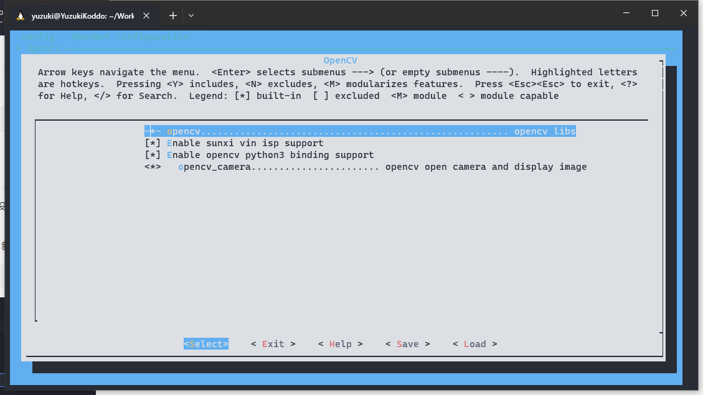

然后编译固件即可，请注意 Python3 编译非常慢，需要耐心等待下。

编写一个 Python 脚本，执行上面的相同操作

```python
import cv2
import numpy as np

DISPLAY_X = 240
DISPLAY_Y = 240

frame_width = 480
frame_height = 480
frame_rate = 30

cap = cv2.VideoCapture(0) # 打开摄像头

if not cap.isOpened():
    print("Could not open video device.")
    exit(1)

print("Successfully opened video device.")
cap.set(cv2.CAP_PROP_FRAME_WIDTH, frame_width)
cap.set(cv2.CAP_PROP_FRAME_HEIGHT, frame_height)
cap.set(cv2.CAP_PROP_FPS, frame_rate)

ofs = open("/dev/fb0", "wb") # 打开帧缓冲区

while True:
    ret, frame = cap.read() # 读取一帧图像
    if frame.dtype != np.uint8 or frame.ndim != 3:
        print("Not 8 bits per pixel and channel.")
    elif frame.shape[2] != 3:
        print("Not 3 channels.")
    else:
        frame = cv2.transpose(frame) # 图像转置
        frame = cv2.flip(frame, 0) # 图像翻转
        frame = cv2.resize(frame, (DISPLAY_X, DISPLAY_Y)) # 改变图像大小
        framebuffer_width = DISPLAY_X
		_ = open("/sys/class/graphics/fb0/bits_per_pixel", "r")
		framebuffer_depth = int(_.read()[:2])
		_.close()
        frame_size = frame.shape
        framebuffer_compat = np.zeros(frame_size, dtype=np.uint8)
        if framebuffer_depth == 16:
            framebuffer_compat = cv2.cvtColor(frame, cv2.COLOR_BGR2BGR565)
            for y in range(frame_size[0]):
                ofs.seek(y * framebuffer_width * 2)
                ofs.write(framebuffer_compat[y].tobytes())
        elif framebuffer_depth == 32:
            split_bgr = cv2.split(frame)
            split_bgr.append(np.full((frame_size[0], frame_size[1]), 255, dtype=np.uint8))
            framebuffer_compat = cv2.merge(split_bgr)
            for y in range(frame_size[0]):
                ofs.seek(y * framebuffer_width * 4)
                ofs.write(framebuffer_compat[y].tobytes())
        else:
            print("Unsupported depth of framebuffer.")

cap.release()
ofs.close()

```

## 编译系统

初始化 SDK 环境。

```
source build/envsetup.sh
```

然后就是编译 SDK 输出固件

```
mp -j32
```

如果出现错误，请再次运行 

```
mp -j1 V=s 
```

以单线程编译解决依赖关系，并且输出全部编译 LOG 方便排查错误。

## 线刷固件

### 修改 U-boot 支持线刷固件

U-Boot 默认配置的是使用 SDC2 也就是 TinyVision 的 SD-NAND 刷写固件。同时也支持使用 SDC0 也就是 TF 卡烧写固件，但是需要手动配置一下 U-Boot。否则会出现如下问题，U-Boot 去初始化不存在的 SD NAND 导致刷不进系统。

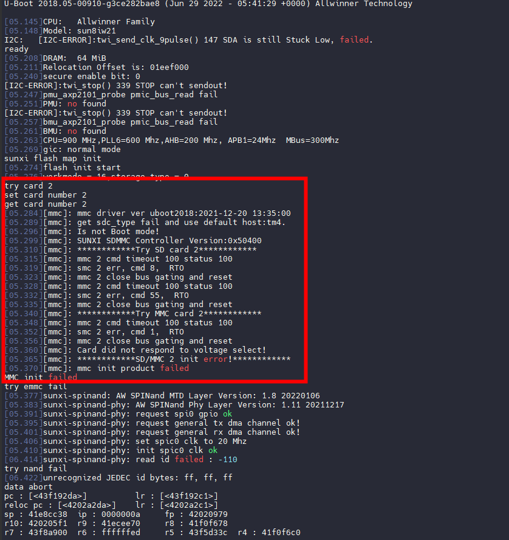

前往文件夹 `brandy/brandy-2.0/u-boot-2018/drivers/sunxi_flash/mmc/sdmmc.c` 

找到第 188 行，将 `return sdmmc_init_for_sprite(0, 2);` 修改为 `return sdmmc_init_for_sprite(0, 0);`

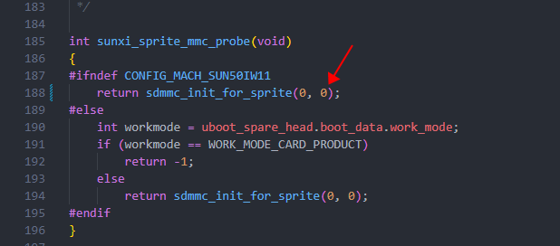

修改后需要重新编译固件。插入空白的 TF 卡，如果不是空白的 TF 卡可能出现芯片不进入烧录模式。

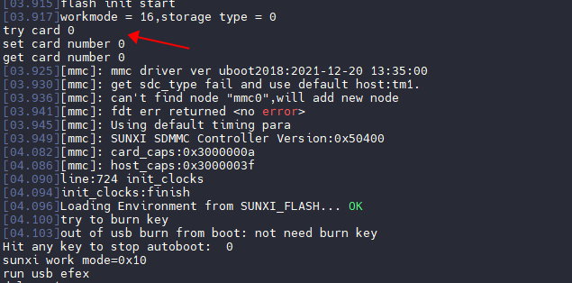

出现 `try card 0` 开始下载到 TF 卡内


# OpenWrt 编译开发


* 源码存放在百度网盘： https://pan.baidu.com/s/1a0uS7kqXiEdKFFgIJ3HF5g?pwd=qm83  提取码：qm83 
* git仓库位置  https://github.com/YuzukiHD/OpenWrt/

## 编译

获取镜像后，进行解压缩，建议使用百度网盘版本，因为网络问题，可能导致某些软件包无法正常下载，编译报错。

解压压缩包后，执行 make menuconfig 进入到配置界面，

```shell
ubuntu@ubuntu1804:~/OpenWrt$ make menuconfig 
```

参考下图红框所示，三个选项选中 为 TinyVision开发板，保证一模一样。
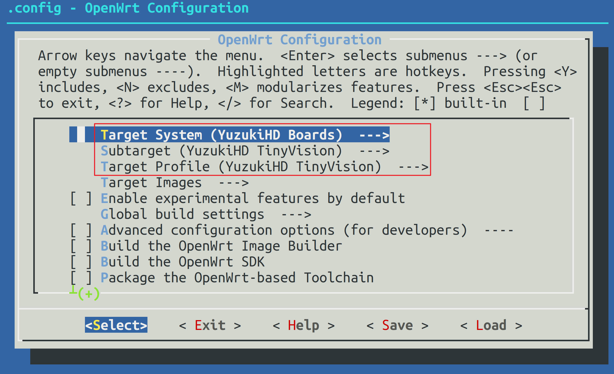
选中完成后，保存退出，继续执行make 命令即可开始编译。

```shell
ubuntu@ubuntu1804:~/OpenWrt$ make  

```

如果你不想使用压缩包，而是从头获取源码，需要在 make menuconfig选中开发板之前 执行  ` ./scripts/feeds update -a ` 命令检查远端仓库和本地仓库的差异进行更新，之后执行 `./scripts/feeds install -a` 来安装远端更新。

```shell
ubuntu@ubuntu1804:~/OpenWrt$ ./scripts/feeds update -a
Updating feed 'packages' from 'https://github.com/openwrt/packages.git;openwrt-23.05' ...
remote: Enumerating objects: 101, done.
remote: Counting objects: 100% (101/101), done.
remote: Compressing objects: 100% (44/44), done.
remote: Total 68 (delta 44), reused 45 (delta 21), pack-reused 0
Unpacking objects: 100% (68/68), done.
From https://github.com/openwrt/packages
   421e2c75a..d26bbd792  openwrt-23.05 -> origin/openwrt-23.05
Updating 421e2c75a..d26bbd792
Fast-forward
 admin/btop/Makefile                                       |  7 ++++---
 lang/rust/Makefile                                        |  4 ++--
 lang/rust/patches/0001-Update-xz2-and-use-it-static.patch | 14 +++++++-------
 lang/rust/patches/0002-rustc-bootstrap-cache.patch        | 10 +++++-----
 lang/rust/patches/0003-bump-libc-deps-to-0.2.146.patch    | 28 ----------------------------
 lang/rust/rust-values.mk                                  |  6 ++++++
 net/adblock-fast/Makefile                                 |  2 +-
 net/adblock-fast/files/etc/init.d/adblock-fast            |  2 +-
 net/dnsproxy/Makefile                                     |  4 ++--
 net/sing-box/Makefile                                     |  9 ++-------
 net/travelmate/Makefile                                   |  2 +-
 net/travelmate/files/travelmate.sh                        | 12 +++++++++++-
 net/uspot/Makefile                                        | 10 ++++++----
 net/v2ray-geodata/Makefile                                | 12 ++++++------
 net/v2raya/Makefile                                       |  6 +++---
 15 files changed, 57 insertions(+), 71 deletions(-)
Updating feed 'luci' from 'https://github.com/openwrt/luci.git;openwrt-23.05' ...
remote: Enumerating objects: 49, done.
remote: Counting objects: 100% (49/49), done.
remote: Compressing objects: 100% (18/18), done.
remote: Total 31 (delta 12), reused 25 (delta 6), pack-reused 0
Unpacking objects: 100% (31/31), done.
From https://github.com/openwrt/luci
   11a1a43..fa4b280  openwrt-23.05 -> origin/openwrt-23.05
Updating 11a1a43..fa4b280
Fast-forward
 applications/luci-app-firewall/htdocs/luci-static/resources/view/firewall/rules.js                  |  3 +++
 applications/luci-app-https-dns-proxy/Makefile                                                      |  2 +-
 applications/luci-app-https-dns-proxy/htdocs/luci-static/resources/view/https-dns-proxy/overview.js |  8 ++++----
 themes/luci-theme-openwrt-2020/htdocs/luci-static/openwrt2020/cascade.css                           | 13 +++++++++++++
 4 files changed, 21 insertions(+), 5 deletions(-)
Updating feed 'routing' from 'https://github.com/openwrt/routing.git;openwrt-23.05' ...
Already up to date.
Updating feed 'telephony' from 'https://github.com/openwrt/telephony.git;openwrt-23.05' ...
Already up to date.
Create index file './feeds/packages.index' 
Collecting package info: done
Create index file './feeds/luci.index' 
Collecting package info: done
Create index file './feeds/routing.index' 
Create index file './feeds/telephony.index' 
ubuntu@ubuntu1804:~/Downloads/TinyVision/OpenWrt$ ./scripts/feeds install -a
Installing all packages from feed packages.
Installing all packages from feed luci.
Installing all packages from feed routing.
Installing all packages from feed telephony.
ubuntu@ubuntu1804:~/OpenWrt$ 

```

## 烧写镜像

系统编译完成后，镜像输出在 `build_dir/target-arm_cortex-a7+neon-vfpv4_musl_eabi/linux-yuzukihd_v851se/tmp/` 目录下，名称为 `openwrt-yuzukihd-v851se-yuzuki_tinyvision-squashfs-sysupgrade.img.gz` 需要先使用 `tar -xvf` 进行解压缩，之后 使用 `dd if` 命令 完整写入sd卡设备，或者 使用 `wind32diskimage`工具。 或者使用 `balenaEtcher` 等 进行烧录。

# Debian 12 构建与编译

## 构建 SyterKit 作为 Bootloader

SyterKit 是一个纯裸机框架，用于 TinyVision 或者其他 v851se/v851s/v851s3/v853 等芯片的开发板，SyterKit 使用 CMake 作为构建系统构建，支持多种应用与多种外设驱动。同时 SyterKit 也具有启动引导的功能，可以替代 U-Boot 实现快速启动

### 获取 SyterKit 源码

SyterKit 源码位于GitHub，可以前往下载。

```shell
git clone https://github.com/YuzukiHD/SyterKit.git
```

### 从零构建 SyterKit

构建 SyterKit 非常简单，只需要在 Linux 操作系统中安装配置环境即可编译。SyterKit 需要的软件包有：

- `gcc-arm-none-eabi`
- `CMake`

对于常用的 Ubuntu 系统，可以通过如下命令安装

```shell
sudo apt-get update
sudo apt-get install gcc-arm-none-eabi cmake build-essential -y
```

然后新建一个文件夹存放编译的输出文件，并且进入这个文件夹

```shell
mkdir build
cd build
```

然后运行命令编译 SyterKit

```shell
cmake ..
make
```

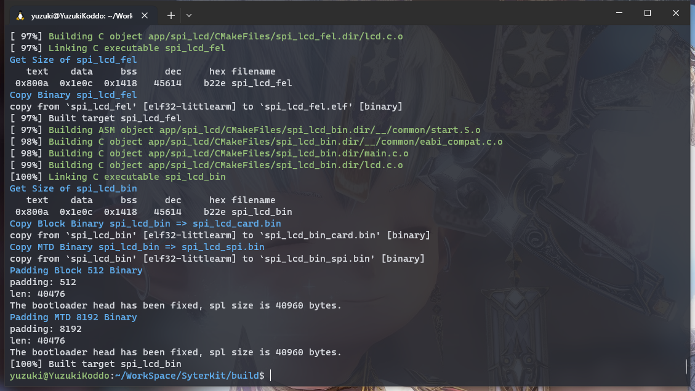

编译后的可执行文件位于 `build/app` 中，这里包括 SyterKit 的多种APP可供使用。


这里我们使用的是 `syter_boot` 作为启动引导。进入 syter_boot 文件夹，可以看到这些文件

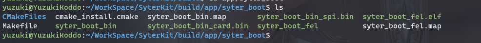

由于 TinyVision 是 TF 卡启动，所以我们需要用到 `syter_boot_bin_card.bin`

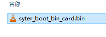

## 编译 Linux-6.1 内核

由于 Debian 12 配套的内核是 Linux 6.1 LTS，所以这里我们选择构建 Linux 6.1 版本内核。

### 搭建编译环境

安装一些必要的安装包

```plaintext
sudo apt-get update && sudo apt-get install -y gcc-arm-none-eabi gcc-arm-linux-gnueabihf g++-arm-linux-gnueabihf build-essential libncurses5-dev zlib1g-dev gawk flex bison quilt libssl-dev xsltproc libxml-parser-perl mercurial bzr ecj cvs unzip lsof
```

### 获取内核源码

内核源码托管在 Github 上，可以直接获取到，这里使用 `--depth=1` 指定 git 深度为 1 加速下载。

```plaintext
git clone http://github.com/YuzukiHD/TinyVision --depth=1
```

然后进入内核文件夹

```plaintext
cd kernel/linux-6.1
```

### 配置内核选项

应用 defconfig

```plaintext
CROSS_COMPILE=arm-linux-gnueabihf- make ARCH=arm tinyvision_defconfig
```

进入 `menuconfig` 配置选项

```plaintext
CROSS_COMPILE=arm-linux-gnueabihf- make ARCH=arm menuconfig
```

进入 `General Setup ->`，选中 `Control Group Support`

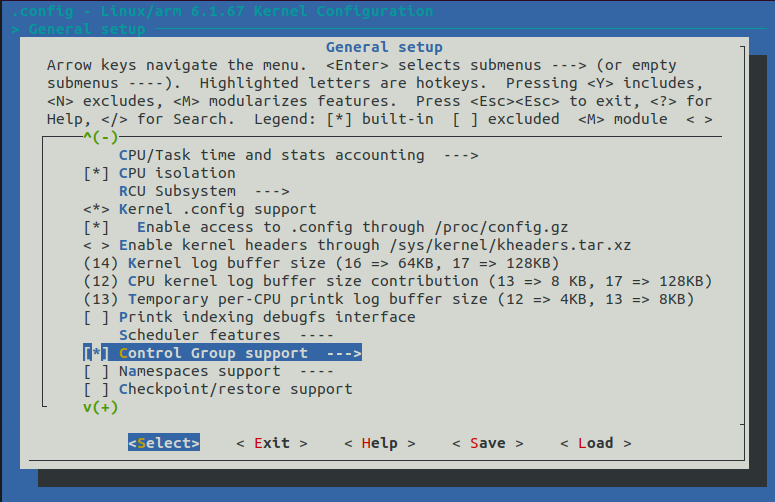

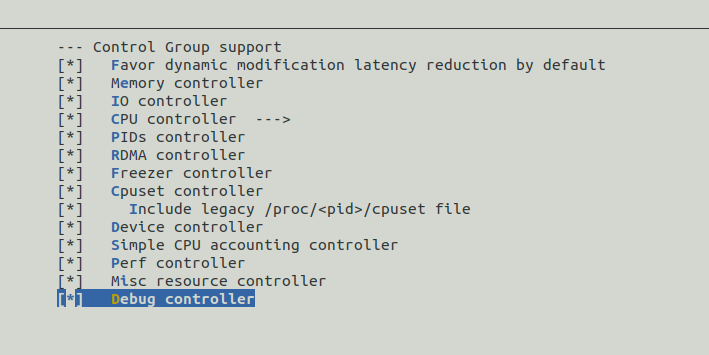

前往 `File Systems` 找到 `FUSE (Filesystem in Userspace) support`

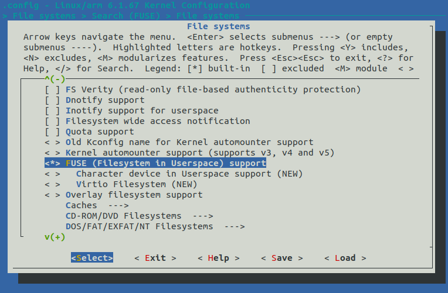

前往 `File Systems` 找到 `Inotify support for userspace`

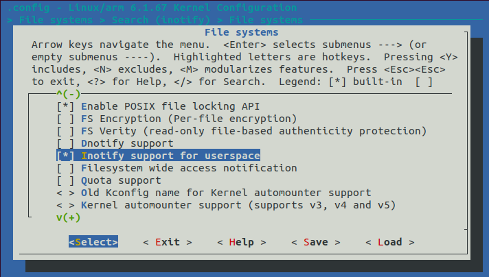

编译内核

```plaintext
CROSS_COMPILE=arm-linux-gnueabihf- make ARCH=arm
```

## 使用 debootstrap 构建 debian rootfs

### 准备环境，依赖

下载安装依赖环境

```plaintext
sudo apt install debootstrap qemu qemu-user-static qemu-system qemu-utils qemu-system-misc binfmt-support dpkg-cross debian-ports-archive-keyring --no-install-recommends
```

生成目标镜像，配置环境，这里我们生成一个 1024M 的镜像文件用于存放 rootfs

```shell
dd if=/dev/zero of=rootfs.img bs=1M count=1024
mkdir rootfs
mkfs.ext4 rootfs.img
sudo mount rootfs.img rootfs
```

### 开始构建基础 rootfs

这里我们选择最新的 debian12 (bookwarm) 作为目标镜像，使用清华源来构建，输出到目标目录 rootfs_data 文件夹中。新版本的 debootstrap 只需要运行一次即可完成两次 stage 的操作，相较于老版本方便许多。

```shell
sudo debootstrap --arch=armhf bookworm rootfs_data https://mirrors.tuna.tsinghua.edu.cn/debian/
```

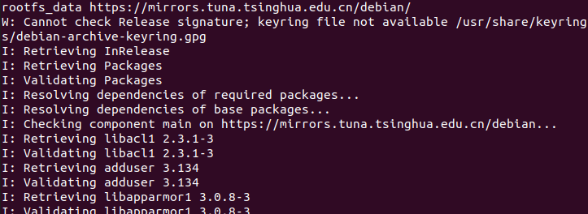

看到 `I: Base system installed successfully.` 就是构建完成了

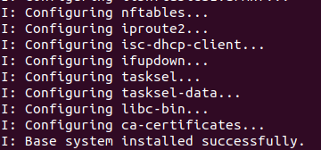

等待构建完成后，使用chroot进入到目录，这里编写一个挂载脚本方便挂载使用，新建文件 `ch-mount.sh` 并写入以下内容：

```bash
#!/bin/bash

function mnt() {
    echo "MOUNTING"
    sudo mount -t proc /proc ${2}proc
    sudo mount -t sysfs /sys ${2}sys
    sudo mount -o bind /dev ${2}dev
    sudo mount -o bind /dev/pts ${2}dev/pts		
    sudo chroot ${2}
}

function umnt() {
    echo "UNMOUNTING"
    sudo umount ${2}proc
    sudo umount ${2}sys
    sudo umount ${2}dev/pts
    sudo umount ${2}dev

}

if [ "$1" == "-m" ] && [ -n "$2" ] ;
then
    mnt $1 $2
elif [ "$1" == "-u" ] && [ -n "$2" ];
then
    umnt $1 $2
else
    echo ""
    echo "Either 1'st, 2'nd or both parameters were missing"
    echo ""
    echo "1'st parameter can be one of these: -m(mount) OR -u(umount)"
    echo "2'nd parameter is the full path of rootfs directory(with trailing '/')"
    echo ""
    echo "For example: ch-mount -m /media/sdcard/"
    echo ""
    echo 1st parameter : ${1}
    echo 2nd parameter : ${2}
fi
```

然后赋予脚本执行的权限

```shell
chmod 777 ch-mount.sh
```

- 使用 `./ch-mount.sh -m rootfs_data` 挂载
- 使用 `./ch-mount.sh -u rootfs_data` 卸载

执行挂载，可以看到进入了 debian 的 rootfs

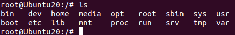

配置系统字符集，选择 en_US 作为默认字符集

```shell
export LC_ALL=en_US.UTF-8
apt-get install locales
dpkg-reconfigure locales
```

选择一个就可以

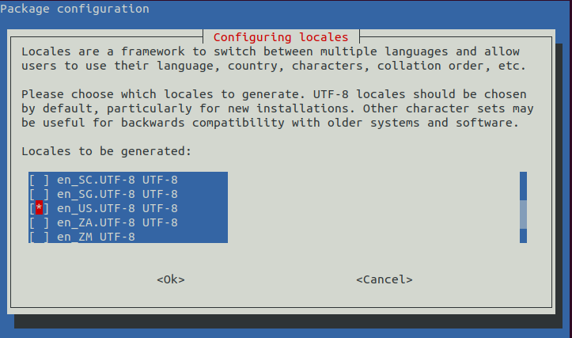

直接 OK 下一步

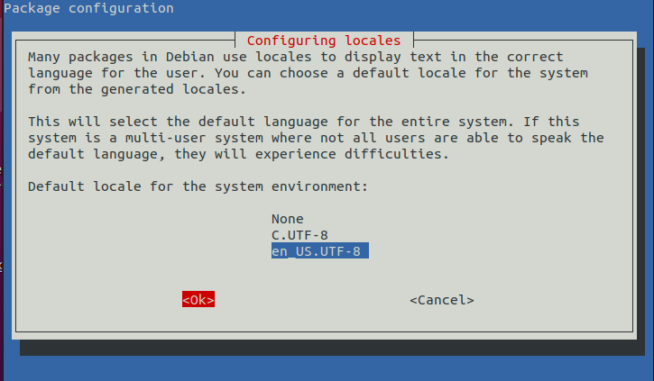

安装 Linux 基础工具

```plaintext
apt install sudo ssh openssh-server net-tools ethtool wireless-tools network-manager iputils-ping rsyslog alsa-utils bash-completion gnupg busybox kmod wget git curl --no-install-recommends
```

安装编译工具

```bash
apt install build-essential
```

安装 Linux nerd 工具

```plaintext
apt install vim nano neofetch
```

设置本机入口 ip 地址

```plaintext
cat <<EOF > /etc/hosts
127.0.0.1       localhost
127.0.1.1       $HOST
::1             localhost ip6-localhost ip6-loopback
ff02::1         ip6-allnodes
ff02::2         ip6-allrouters
EOF
```

配置网卡

```plaintext
mkdir -p /etc/network
cat >/etc/network/interfaces <<EOF
auto lo
iface lo inet loopback

auto eth0
iface eth0 inet dhcp
EOF
```

配置 DNS 地址

```plaintext
cat >/etc/resolv.conf <<EOF
nameserver 1.1.1.1
nameserver 8.8.8.8
EOF
```

配置分区

```plaintext
cat >/etc/fstab <<EOF
#<file system> <mount point>   <type>  <options>       <dump>  <pass>
/dev/mmcblk0p1  /boot   vfat    defaults                0       0
/dev/mmcblk0p2  /       ext4    defaults,noatime        0       1
EOF
```

配置 root 密码

```plaintext
passwd
```

配置主机名

```plaintext
echo TinyVision > /etc/hostname
```

退出 chroot

```plaintext
exit
```

取消挂载 chroot

```plaintext
./ch-mount.sh -u rootfs_data/
```

### 拷贝 rootfs 到镜像中

```plaintext
sudo cp -raf rootfs_data/* rootfs
```

取消挂载

```plaintext
sudo umount rootfs
```

至此 debian rootfs 就制作好了。

## 打包固件

编译完成 bootloader，内核，rootfs 后，还需要打包固件成为可以 dd 写入的固件，这里我们使用 genimage 工具来生成构建。

## 生成刷机镜像

编译内核后，可以在文件夹 `arch/arm/boot/dts/allwinner` 生成`sun8i-v851se-tinyvision.dtb` ，在文件夹`arch/arm/boot` 生成 `zImage` ，把他们拷贝出来。

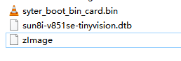

然后将 `sun8i-v851se-tinyvision.dtb` 改名为 `sunxi.dtb` ，这个设备树名称是定义在 SyterKit 源码中的，如果之前修改了 SyterKit 的源码需要修改到对应的名称，SyterKit 会去读取这个设备树。

然后编写一个 `config.txt` 作为配置文件

```plaintext
[configs]
bootargs=root=/dev/mmcblk0p2 earlyprintk=sunxi-uart,0x02500000 loglevel=2 initcall_debug=0 rootwait console=ttyS0 init=/sbin/init
mac_addr=4a:13:e4:f9:79:75
bootdelay=3
```

### 安装 GENIMAGE

这里我们使用 genimage 作为打包工具

```plaintext
sudo apt-get install libconfuse-dev #安装genimage依赖库
sudo apt-get install genext2fs      # 制作镜像时genimage将会用到
git clone https://github.com/pengutronix/genimage.git
cd genimage
./autogen.sh                        # 配置生成configure
./configure                         # 配置生成makefile
make
sudo make install
```

编译后运行试一试，这里正常

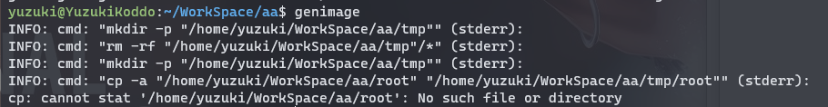

### 使用 GENIMAGE 打包固件

编写 genimage.cfg 作为打包的配置

```cfg
image boot.vfat {
	vfat {
		files = {
			"zImage",
			"sunxi.dtb",
			"config.txt"
		}
	}
	size = 32M
}

image sdcard.img {
	hdimage {}

	partition boot0 {
		in-partition-table = "no"
		image = "syter_boot_bin_card.bin"
		offset = 8K
	}

	partition boot0-gpt {
		in-partition-table = "no"
		image = "syter_boot_bin_card.bin"
		offset = 128K
	}

	partition kernel {
		partition-type = 0xC
		bootable = "true"
		image = "boot.vfat"
	}
	
	partition rootfs {
		partition-type = 0x83
		bootable = "true"
		image = "rootfs.img"
	}
}
```

由于genimage的脚本比较复杂，所以编写一个 `genimage.sh` 作为简易使用的工具

```sh
#!/usr/bin/env bash

die() {
  cat <<EOF >&2
Error: $@

Usage: ${0} -c GENIMAGE_CONFIG_FILE
EOF
  exit 1
}

# Parse arguments and put into argument list of the script
opts="$(getopt -n "${0##*/}" -o c: -- "$@")" || exit $?
eval set -- "$opts"

GENIMAGE_TMP="${BUILD_DIR}/genimage.tmp"

while true ; do
	case "$1" in
	-c)
	  GENIMAGE_CFG="${2}";
	  shift 2 ;;
	--) # Discard all non-option parameters
	  shift 1;
	  break ;;
	*)
	  die "unknown option '${1}'" ;;
	esac
done

[ -n "${GENIMAGE_CFG}" ] || die "Missing argument"

# Pass an empty rootpath. genimage makes a full copy of the given rootpath to
# ${GENIMAGE_TMP}/root so passing TARGET_DIR would be a waste of time and disk
# space. We don't rely on genimage to build the rootfs image, just to insert a
# pre-built one in the disk image.

trap 'rm -rf "${ROOTPATH_TMP}"' EXIT
ROOTPATH_TMP="$(mktemp -d)"
GENIMAGE_TMP="$(mktemp -d)"
rm -rf "${GENIMAGE_TMP}"

genimage \
	--rootpath "${ROOTPATH_TMP}"     \
	--tmppath "${GENIMAGE_TMP}"    \
	--inputpath "${BINARIES_DIR}"  \
	--outputpath "${BINARIES_DIR}" \
	--config "${GENIMAGE_CFG}"
```

准备完成，文件如下所示

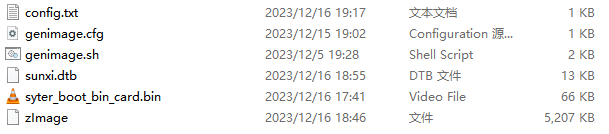

运行命令进行打包

```plaintext
chmod 777 genimage.sh
./genimage.sh -c genimage.cfg
```


打包完成，可以找到 `sdcard.img`

使用软件烧录固件到TF卡上


# 主线内核开发

## SyterKit

SyterKit 是一个纯裸机框架，用于 TinyVision 或者其他 v851se/v851s/v851s3/v853 等芯片的开发板，SyterKit 使用 CMake 作为构建系统构建，支持多种应用与多种外设驱动。同时 SyterKit 也具有启动引导的功能，可以替代 U-Boot 实现快速启动

### 获取 SyterKit 源码

SyterKit 源码位于GitHub，可以前往下载。

```shell
git clone https://github.com/YuzukiHD/SyterKit.git
```

### 从零构建 SyterKit

构建 SyterKit 非常简单，只需要在 Linux 操作系统中安装配置环境即可编译。SyterKit 需要的软件包有：

- `gcc-arm-none-eabi`
- `CMake`

对于常用的 Ubuntu 系统，可以通过如下命令安装

```shell
sudo apt-get update
sudo apt-get install gcc-arm-none-eabi cmake build-essential -y
```

然后新建一个文件夹存放编译的输出文件，并且进入这个文件夹

```shell
mkdir build
cd build
```

然后运行命令编译 SyterKit

```shell
cmake ..
make
```


编译后的可执行文件位于 `build/app` 中，这里包括 SyterKit 的多种APP可供使用。

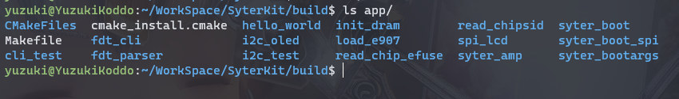

这里我们使用的是 `syter_boot` 作为启动引导。进入 syter_boot 文件夹，可以看到这些文件


由于 TinyVision 是 TF 卡启动，所以我们需要用到 `syter_boot_bin_card.bin`


## 移植 Linux 6.7 主线

有了启动引导，接下来是移植 Linux 6.7 主线，前往 https://kernel.org/ 找到 Linux 6.7，选择 `tarball` 下载

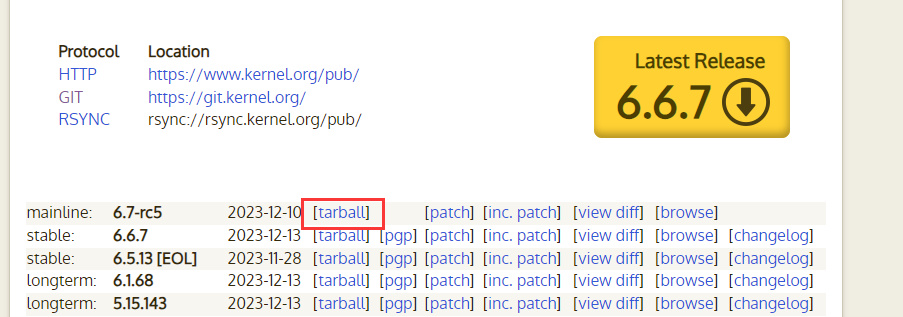

下载后解压缩

```shell
tar xvf linux-6.7-rc5.tar.gz
```

进入 linux 6.7 目录，开始移植相关驱动。

### 搭建 Kernel 相关环境

Kernel 编译需要一些软件包，需要提前安装。

```plaintext
sudo apt-get update && sudo apt-get install -y gcc-arm-none-eabi gcc-arm-linux-gnueabihf g++-arm-linux-gnueabihf build-essential libncurses5-dev zlib1g-dev gawk flex bison quilt libssl-dev xsltproc libxml-parser-perl mercurial bzr ecj cvs unzip lsof
```

安装完成后可以尝试编译一下，看看能不能编译通过，先应用配置文件

```plaintext
CROSS_COMPILE=arm-linux-gnueabihf- make ARCH=arm sunxi_defconfig
```

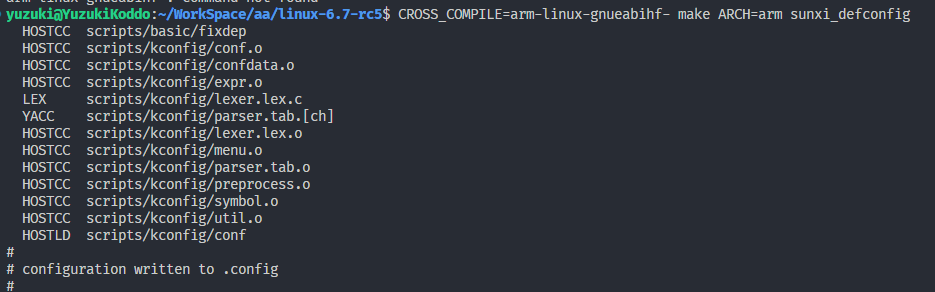

然后尝试编译

```plaintext
CROSS_COMPILE=arm-linux-gnueabihf- make ARCH=arm
```

可以用 `-j32` 来加速编译，`32` 指的是使用32线程编译，一般cpu有几个核心就设置几线程

```plaintext
CROSS_COMPILE=arm-linux-gnueabihf- make ARCH=arm -j32
```

正常编译

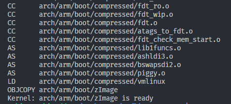

### 移植 clk 驱动

这里提供已经适配修改后的驱动：https://github.com/YuzukiHD/TinyVision/tree/main/kernel/linux-6.7-driver 可以直接使用。

也可以参考 https://github.com/YuzukiHD/TinyVision/tree/main/kernel/bsp/drivers/clk 中的驱动移植。

进入文件夹 `include/dt-bindings/clock/` 新建文件 `sun8i-v851se-ccu.h` ，将 CLK 填入

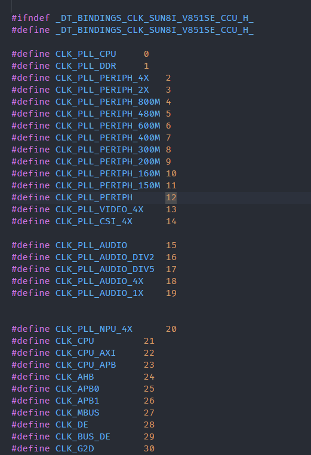

进入 `include/dt-bindings/reset` 新建文件 `sun8i-v851se-ccu.h` 将 RST 填入

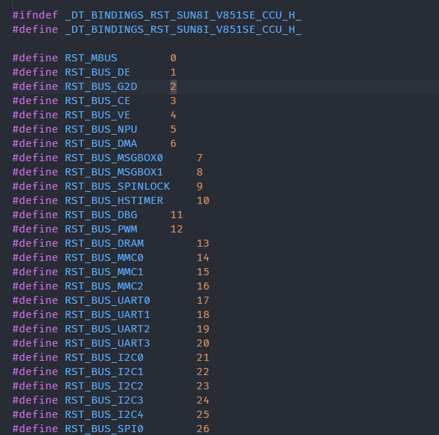

进入 `drivers/clk/sunxi-ng` 找到 `sunxi-ng` clk 驱动，复制文件`ccu-sun20i-d1.c` 和 `ccu-sun20i-d1.h` 文件并改名为 `ccu-sun8i-v851se.c` ，`ccu-sun8i-v851se.h` 作为模板。

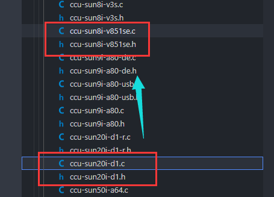

将文件中的 `SUN20I_D1` 改为 `SUN8I_V851SE`

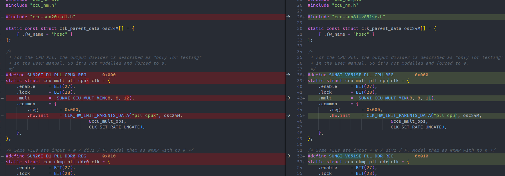

打开芯片数据手册[V851SX_Datasheet_V1.2.pdf](https://github.com/YuzukiHD/TinyVision/blob/main/docs/hardware/TinyVision/datasheet/V851SX_Datasheet_V1.2.pdf)，找到 CCU 章节

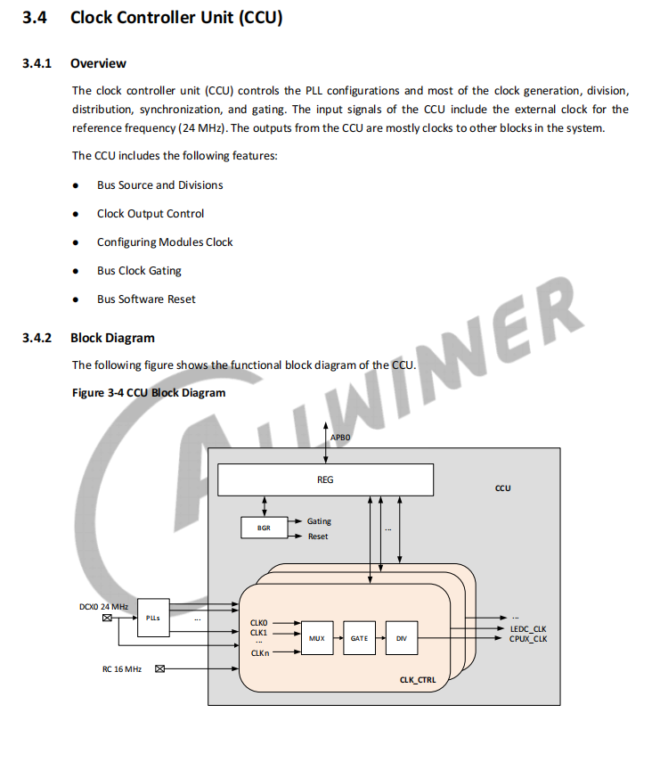

对照手册编写驱动文件适配 V851se 平台。

然后找到 `drivers/clk/sunxi-ng/Kconfig` 文件，增加刚才编写的驱动的 Kconfig 说明


```plaintext
config SUN8I_V851SE_CCU
	tristate "Support for the Allwinner V851se CCU"
	default y
	depends on MACH_SUN8I || COMPILE_TEST
```

同时打开 `drivers/clk/sunxi-ng/Makefile`

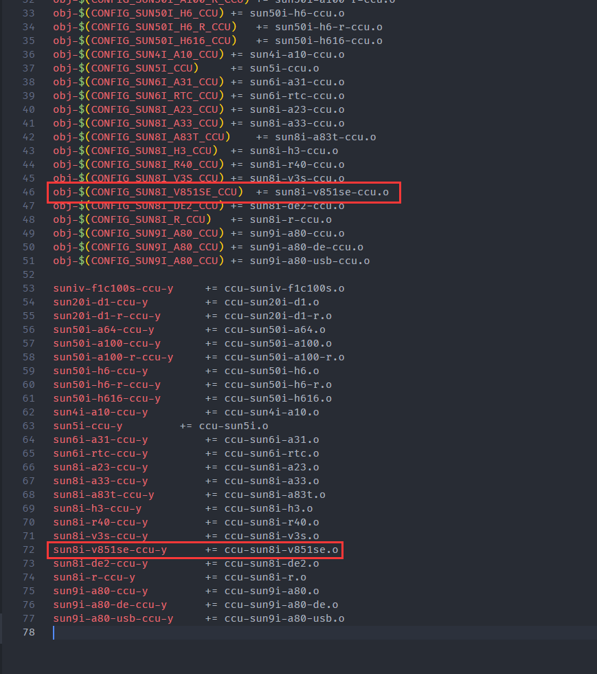

```plaintext
obj-$(CONFIG_SUN8I_V851SE_CCU)	+= sun8i-v851se-ccu.o

sun8i-v851se-ccu-y		+= ccu-sun8i-v851se.o
```

来检查一下是否移植成功，先查看 `menuconfig`，找到 `Device Drivers > Common Clock Framework`，查看是否有 V851se 平台选项出现

```plaintext
CROSS_COMPILE=arm-linux-gnueabihf- make ARCH=arm menuconfig
```

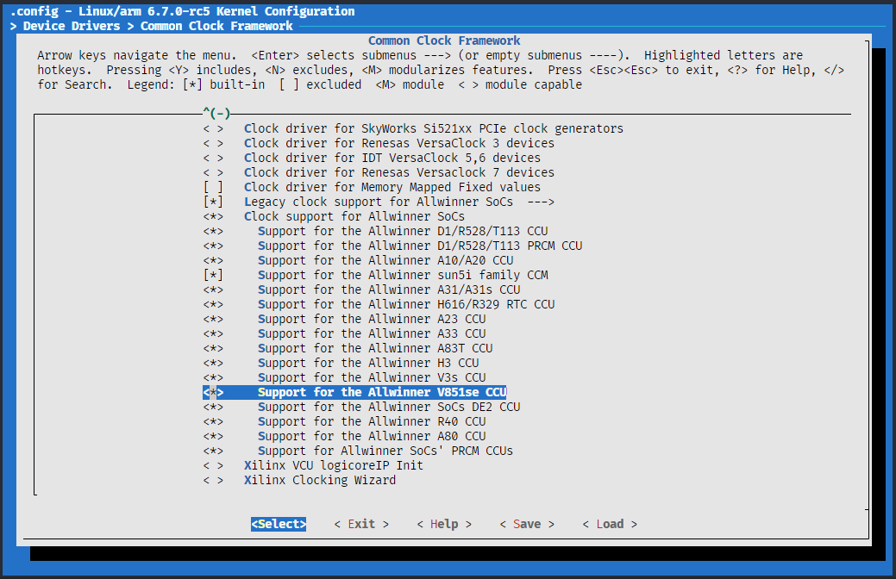

编译测试，有几处未使用的变量的警告，无视即可。

```plaintext
CROSS_COMPILE=arm-linux-gnueabihf- make ARCH=arm 
```

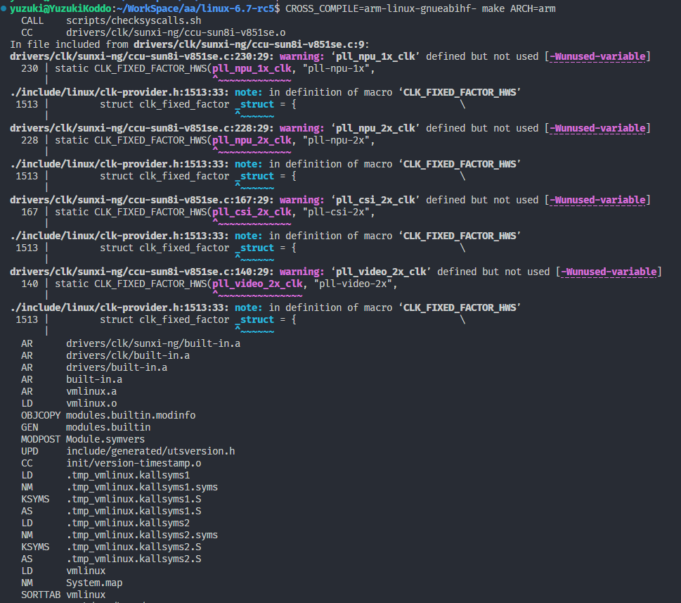

正常编译成功

### 移植 pinctrl 驱动

这里提供已经适配修改后的驱动：https://github.com/YuzukiHD/TinyVision/tree/main/kernel/linux-6.7-driver 可以直接使用。

前往`drivers/pinctrl/sunxi/` 新建文件 `pinctrl-sun8i-v851se.c`

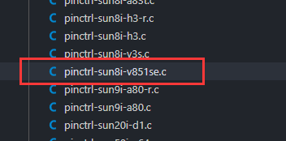

打开 [V851SE_PINOUT_V1.0.xlsx](https://github.com/YuzukiHD/TinyVision/blob/main/docs/hardware/TinyVision/datasheet/V851SE_PINOUT_V1.0.xlsx) 对照填入PIN的值与功能。

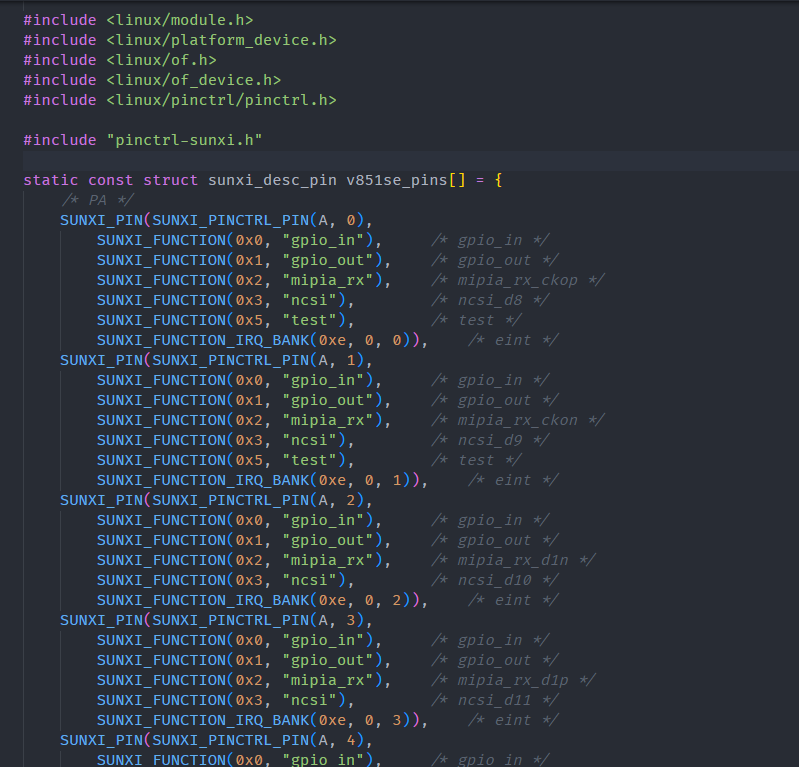

同样的，修改 `drivers/pinctrl/sunxi/Kconfig` 增加选项

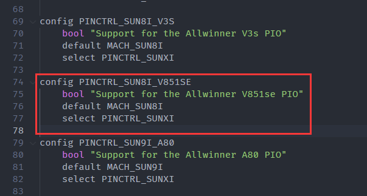

修改 `drivers/pinctrl/sunxi/Makefile` 增加路径

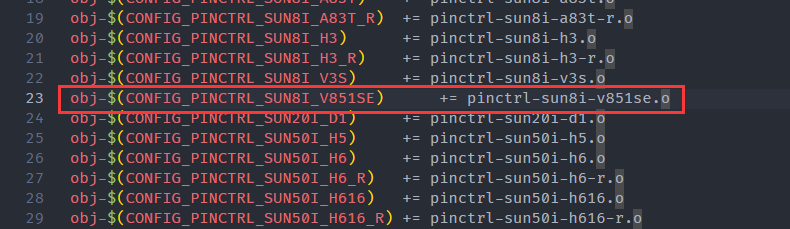

来检查一下是否移植成功，先查看 `menuconfig`，找到 `> Device Drivers > Pin controllers`，查看是否有 V851se 平台选项出现

```plaintext
CROSS_COMPILE=arm-linux-gnueabihf- make ARCH=arm menuconfig
```

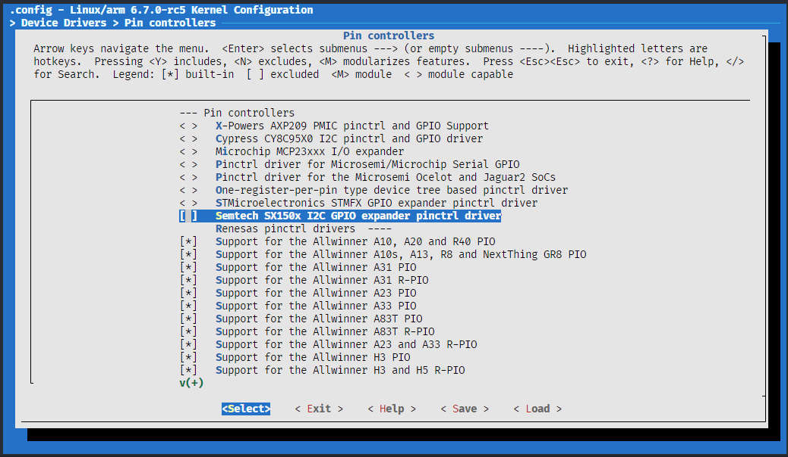

编译测试，编译通过

```plaintext
CROSS_COMPILE=arm-linux-gnueabihf- make ARCH=arm 
```

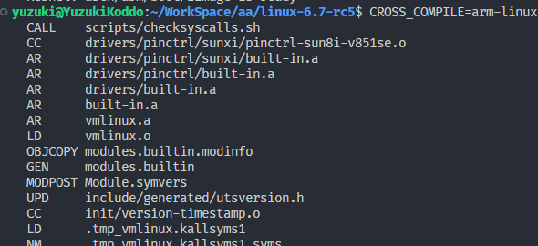

### 编写设备树

这里提供已经适配修改后的驱动：https://github.com/YuzukiHD/TinyVision/tree/main/kernel/linux-6.7-driver/dts 可以直接使用。

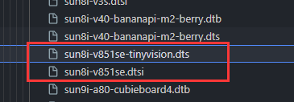

这部分直接给结果了，把上面适配的设备树放到`/home/yuzuki/WorkSpace/aa/linux-6.7-rc5/arch/arm/boot/dts/allwinner/` ，修改 `/home/yuzuki/WorkSpace/aa/linux-6.7-rc5/arch/arm/boot/dts/allwinner/Makefile`

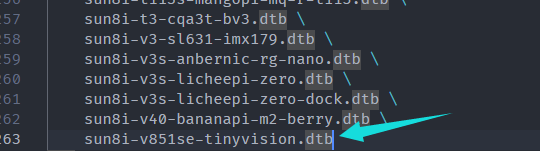

```plaintext
sun8i-v851se-tinyvision.dtb
```

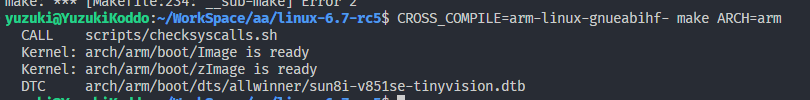

## 生成刷机镜像

编译内核后，可以在文件夹 `arch/arm/boot/dts/allwinner` 生成`sun8i-v851se-tinyvision.dtb` ，在文件夹`arch/arm/boot` 生成 `zImage` ，把他们拷贝出来。


然后将 `sun8i-v851se-tinyvision.dtb` 改名为 `sunxi.dtb` ，这个设备树名称是定义在 SyterKit 源码中的，如果之前修改了 SyterKit 的源码需要修改到对应的名称，SyterKit 会去读取这个设备树。

然后编写一个 `config.txt` 作为配置文件

```plaintext
[configs]
bootargs=cma=4M root=/dev/mmcblk0p2 init=/sbin/init console=ttyS0,115200 earlyprintk=sunxi-uart,0x02500000 rootwait clk_ignore_unused 
mac_addr=4a:13:e4:f9:79:75
bootdelay=3
```

### 安装 genimage

这里我们使用 genimage 作为打包工具

```plaintext
sudo apt-get install libconfuse-dev #安装genimage依赖库
sudo apt-get install genext2fs      # 制作镜像时genimage将会用到
git clone https://github.com/pengutronix/genimage.git
cd genimage
./autogen.sh                        # 配置生成configure
./configure                         # 配置生成makefile
make
sudo make install
```

编译后运行试一试，这里正常


### 使用 genimage 打包固件

编写 genimage.cfg 作为打包的配置

```cfg
image boot.vfat {
	vfat {
		files = {
			"zImage",
			"sunxi.dtb",
			"config.txt"
		}
	}
	size = 8M
}

image sdcard.img {
	hdimage {}

	partition boot0 {
		in-partition-table = "no"
		image = "syter_boot_bin_card.bin"
		offset = 8K
	}

	partition boot0-gpt {
		in-partition-table = "no"
		image = "syter_boot_bin_card.bin"
		offset = 128K
	}

	partition kernel {
		partition-type = 0xC
		bootable = "true"
		image = "boot.vfat"
	}
}
```

由于genimage的脚本比较复杂，所以编写一个 `genimage.sh` 作为简易使用的工具

```sh
#!/usr/bin/env bash

die() {
  cat <<EOF >&2
Error: $@

Usage: ${0} -c GENIMAGE_CONFIG_FILE
EOF
  exit 1
}

# Parse arguments and put into argument list of the script
opts="$(getopt -n "${0##*/}" -o c: -- "$@")" || exit $?
eval set -- "$opts"

GENIMAGE_TMP="${BUILD_DIR}/genimage.tmp"

while true ; do
	case "$1" in
	-c)
	  GENIMAGE_CFG="${2}";
	  shift 2 ;;
	--) # Discard all non-option parameters
	  shift 1;
	  break ;;
	*)
	  die "unknown option '${1}'" ;;
	esac
done

[ -n "${GENIMAGE_CFG}" ] || die "Missing argument"

# Pass an empty rootpath. genimage makes a full copy of the given rootpath to
# ${GENIMAGE_TMP}/root so passing TARGET_DIR would be a waste of time and disk
# space. We don't rely on genimage to build the rootfs image, just to insert a
# pre-built one in the disk image.

trap 'rm -rf "${ROOTPATH_TMP}"' EXIT
ROOTPATH_TMP="$(mktemp -d)"
GENIMAGE_TMP="$(mktemp -d)"
rm -rf "${GENIMAGE_TMP}"

genimage \
	--rootpath "${ROOTPATH_TMP}"     \
	--tmppath "${GENIMAGE_TMP}"    \
	--inputpath "${BINARIES_DIR}"  \
	--outputpath "${BINARIES_DIR}" \
	--config "${GENIMAGE_CFG}"
```

准备完成，文件如下所示


运行命令进行打包

```plaintext
chmod 777 genimage.sh
./genimage.sh -c genimage.cfg
```

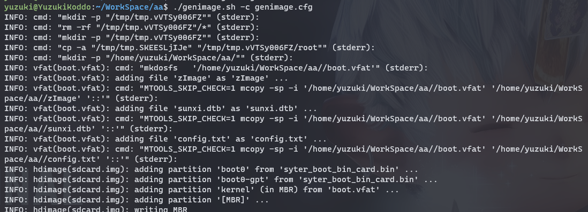

打包完成，可以找到 `sdcard.img`

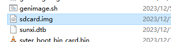

使用软件烧录固件到TF卡上

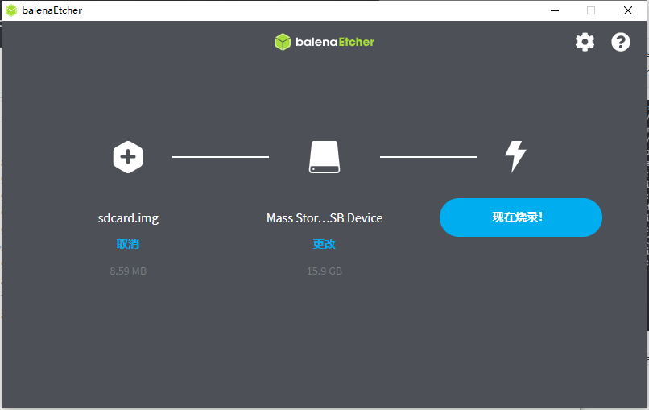

## 测试

插卡，上电，成功启动系统

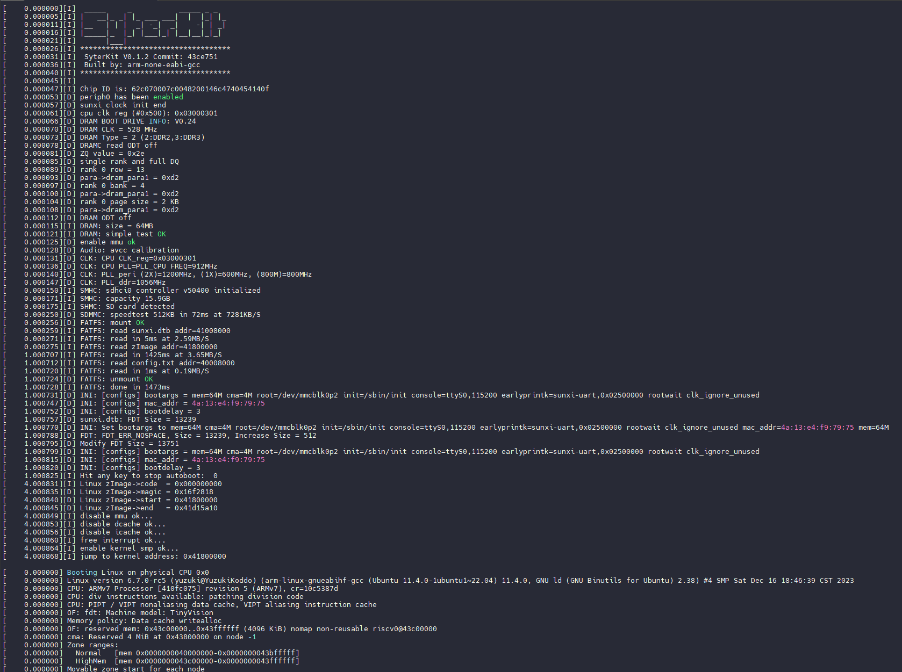

可以看到 Linux 版本是 6.7.0

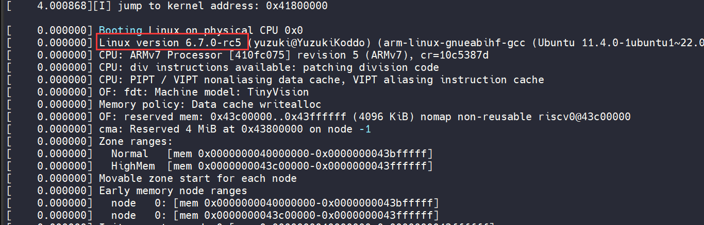

# Tina Linux NPU 开发

TinyVision V851s 使用 OpenCV + NPU 实现 Mobilenet v2 物体识别。上一篇已经介绍了如何使用 TinyVision 与 OpenCV 开摄像头，本篇将使用已经训练完成并且转换后的模型来介绍对接 NPU 实现物体识别的功能。

## MobileNet V2 

MobileNet V2是一种轻量级的卷积神经网络（CNN）架构，专门设计用于在移动设备和嵌入式设备上进行计算资源受限的实时图像分类和目标检测任务。

以下是MobileNet V2的一些关键特点和创新之处：

1. Depthwise Separable Convolution（深度可分离卷积）：MobileNet V2使用了深度可分离卷积，将标准卷积分解为两个步骤：depthwise convolution（深度卷积）和pointwise convolution（逐点卷积）。这种分解方式可以显著减少计算量和参数数量，从而提高模型的轻量化程度。

2. Inverted Residuals with Linear Bottlenecks（带线性瓶颈的倒残差结构）：MobileNet V2引入了带有线性瓶颈的倒残差结构，以增加模型的非线性表示能力。这种结构在每个残差块的中间层采用较低维度的逐点卷积来减少计算量，并使用扩张卷积来增加感受野，使网络能够更好地捕捉图像中的细节和全局信息。

3. Width Multiplier（宽度乘数）：MobileNet V2提供了一个宽度乘数参数，可以根据计算资源的限制来调整模型的宽度。通过减少每个层的通道数，可以进一步减小模型的体积和计算量，适应不同的设备和应用场景。

4. Linear Bottlenecks（线性瓶颈）：为了减少非线性激活函数对模型性能的影响，MobileNet V2使用线性激活函数来缓解梯度消失问题。这种线性激活函数在倒残差结构的中间层中使用，有助于提高模型的收敛速度和稳定性。

总体而言，MobileNet V2通过深度可分离卷积、倒残差结构和宽度乘数等技术，实现了较高的模型轻量化程度和计算效率，使其成为在资源受限的移动设备上进行实时图像分类和目标检测的理想选择。

## NPU

V851s 芯片内置一颗 NPU，其处理性能为最大 0.5 TOPS 并有 128KB 内部高速缓存用于高速数据交换

### NPU 系统架构

NPU 的系统架构如下图所示：

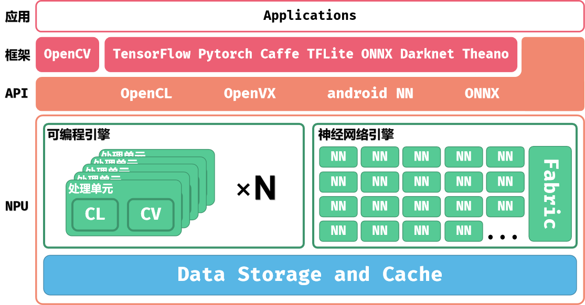

上层的应用程序可以通过加载模型与数据到 NPU 进行计算，也可以使用 NPU 提供的软件 API 操作 NPU 执行计算。

NPU包括三个部分：可编程引擎（Programmable Engines，PPU）、神经网络引擎（Neural Network Engine，NN）和各级缓存。

可编程引擎可以使用 EVIS 硬件加速指令与 Shader 语言进行编程，也可以实现激活函数等操作。

神经网络引擎包含 NN 核心与 Tensor Process Fabric（TPF，图中简写为 Fabric） 两个部分。NN核心一般计算卷积操作， Tensor Process Fabric 则是作为 NN 核心中的高速数据交换的通路。算子是由可编程引擎与神经网络引擎共同实现的。

NPU 支持 UINT8，INT8，INT16 三种数据格式。

### NPU 模型转换

NPU 使用的模型是 NPU 自定义的一类模型结构，不能直接将网络训练出的模型直接导入 NPU 进行计算。这就需要将网络训练出的转换模型到 NPU 的模型上。

NPU 的模型转换步骤如下图所示：

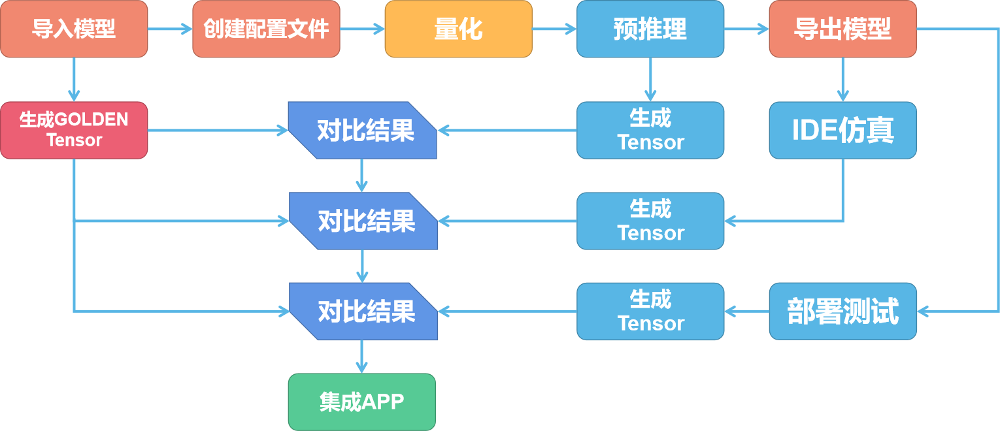

NPU 模型转换包括准备阶段、量化阶段与验证阶段。

#### 准备阶段

首先我们把准备好模型使用工具导入，并创建配置文件。

这时候工具会把模型导入并转换为 NPU 所使用的网络模型、权重模型与配置文件。

配置文件用于对网络的输入和输出的参数进行描述以及配置。这些参数包括输入/输出 tensor 的形状、归一化系数 (均值/零点)、图像格式、tensor 的输出格式、后处理方式等等。

#### 量化阶段

由于训练好的神经网络对数据精度以及噪声的不敏感，因此可以通过量化将参数从浮点数转换为定点数。这样做有两个优点：

（1）减少了数据量，进而可以使用容量更小的存储设备，节省了成本；

（2）由于数据量减少，浮点转化为定点数也大大降低了系统的计算量，也提高了计算的速度。

但是量化也有一个致命缺陷——会导致精度的丢失。

由于浮点数转换为定点数时会大大降低数据量，导致实际的权重参数准确度降低。在简单的网络里这不是什么大问题，但是如果是复杂的多层多模型的网络，每一层微小的误差都会导致最终数据的错误。

那么，可以不量化直接使用原来的数据吗？当然是可以的。

但是由于使用的是浮点数，无法将数据导入到只支持定点运算的 NN 核心进行计算，这就需要可编程引擎来代替 NN 核进行计算，这样可以大大降低运算效率。

另外，在进行量化过程时，不仅对参数进行了量化，也会对输入输出的数据进行量化。如果模型没有输入数据，就不知道输入输出的数据范围。这时候我们就需要准备一些具有代表性的输入来参与量化。这些输入数据一般从训练模型的数据集里获得，例如图片数据集里的图片。

另外选择的数据集不一定要把所有训练数据全部加入量化，通常我们选择几百张能够代表所有场景的输入数据就即可。理论上说，量化数据放入得越多，量化后精度可能更好，但是到达一定阈值后效果增长将会非常缓慢甚至不再增长。

#### 验证阶段

由于上一阶段对模型进行了量化导致了精度的丢失，就需要对每个阶段的模型进行验证，对比结果是否一致。

首先我们需要使用非量化情况下的模型运行生成每一层的 tensor 作为 Golden tensor。输入的数据可以是数据集中的任意一个数据。然后量化后使用预推理相同的数据再次输出一次 tensor，对比这一次输出的每一层的 tensor 与 Golden tensor 的差别。

如果差别较大可以尝试更换量化模型和量化方式。差别不大即可使用 IDE 进行仿真。也可以直接部署到 V851s 上进行测试。

此时测试同样会输出 tensor 数据，对比这一次输出的每一层的 tensor 与 Golden tensor 的差别，差别不大即可集成到 APP 中了。

### NPU 的开发流程

NPU 开发完整的流程如下图所示:


#### 模型训练

在模型训练阶段，用户根据需求和实际情况选择合适的框架（如Caffe、TensorFlow 等）使用数据集进行训练得到符合需求的模型，此模型可称为预训练模型。也可直接使用已经训练好的模型。V851s 的 NPU 支持包括分类、检测、跟踪、人脸、姿态估计、分割、深度、语音、像素处理等各个场景90 多个公开模型。

#### 模型转换

在模型转化阶段，通过Acuity Toolkit 把预训练模型和少量训练数据转换为NPU 可用的模型NBG文件。
一般步骤如下：

1. 模型导入，生成网络结构文件、网络权重文件、输入描述文件和输出描述文件。
2. 模型量化，生成量化描述文件和熵值文件，可改用不同的量化方式。
3. 仿真推理，可逐一对比float 和其他量化精度的仿真结果的相似度，评估量化后的精度是否满足要求。
4. 模型导出，生成端侧代码和*.nb 文件，可编辑输出描述文件的配置，配置是否添加后处理节点等。

#### 模型部署及应用开发

在模型部署阶段，就是基于VIPLite API 开发应用程序实现业务逻辑。

## OpenCV + NPU 源码解析

完整的代码已经上传Github开源，前往以下地址：https://github.com/YuzukiHD/TinyVision/tree/main/tina/openwrt/package/thirdparty/vision/opencv_camera_mobilenet_v2_ssd/src

### Mobilenet v2 前处理

```c
void get_input_data(const cv::Mat& sample, uint8_t* input_data, int input_h, int input_w, const float* mean, const float* scale){
    cv::Mat img;
    if (sample.channels() == 1)
        cv::cvtColor(sample, img, cv::COLOR_GRAY2RGB);
    else
        cv::cvtColor(sample, img, cv::COLOR_BGR2RGB);
    cv::resize(img, img, cv::Size(input_h, input_w));
    uint8_t* img_data = img.data;
    /* nhwc to nchw */
    for (int h = 0; h < input_h; h++) {
        for (int w = 0; w < input_w; w++) {
            for (int c = 0; c < 3; c++) {
                int in_index = h * input_w * 3 + w * 3 + c;
                int out_index = c * input_h * input_w + h * input_w + w;
                input_data[out_index] = (uint8_t)(img_data[in_index]);	//uint8
            }
        }
    }
}

uint8_t *mbv2_ssd_preprocess(const cv::Mat& sample, int input_size, int img_channel) {
	const float mean[3] = {127, 127, 127};
	const float scale[3] = {0.0078125, 0.0078125, 0.0078125};
	int img_size = input_size * input_size * img_channel;
	uint8_t *tensor_data = NULL;
	tensor_data = (uint8_t *)malloc(1 * img_size * sizeof(uint8_t));
	get_input_data(sample, tensor_data, input_size, input_size, mean, scale);
    return tensor_data;
}
```

这段C++代码是用于对输入图像进行预处理，以便输入到MobileNet V2 SSD模型中进行目标检测。

1. `get_input_data`函数：
   - 该函数对输入的图像进行预处理，将其转换为适合MobileNet V2 SSD模型输入的格式。
   - 首先，对输入图像进行通道格式的转换，确保图像通道顺序符合模型要求（RGB格式）。
   - 然后，将图像大小调整为指定的输入尺寸（`input_h * input_w`）。
   - 最后，将处理后的图像数据按照特定顺序（NCHW格式）填充到`input_data`数组中，以便作为模型的输入数据使用。

2. `mbv2_ssd_preprocess`函数：
   - 该函数是对输入图像进行 MobileNet V2 SSD 模型的预处理，并返回处理后的数据。
   - 在函数内部，首先定义了图像各通道的均值（mean）和缩放比例（scale）。
   - 然后计算了输入图像的总大小，并分配了相应大小的内存空间用于存储预处理后的数据。
   - 调用了`get_input_data`函数对输入图像进行预处理，将处理后的数据存储在`tensor_data`中，并最终返回该数据指针。

总的来说，这段代码的功能是将输入图像进行预处理，以适应MobileNet V2 SSD模型的输入要求，并返回预处理后的数据供模型使用。同时需要注意，在使用完`tensor_data`后，需要在适当的时候释放相应的内存空间，以避免内存泄漏问题。

### Mobilenet v2 后处理

这部分分为来讲:

```cpp
// 比较函数，用于按照分数对Bbox_t对象进行排序
bool comp(const Bbox_t &a, const Bbox_t &b) {
    return a.score > b.score;
}

// 计算两个框之间的交集面积
static inline float intersection_area(const Bbox_t& a, const Bbox_t& b) {
    // 将框表示为cv::Rect_<float>对象
    cv::Rect_<float> rect_a(a.xmin, a.ymin, a.xmax-a.xmin, a.ymax-a.ymin);
    cv::Rect_<float> rect_b(b.xmin, b.ymin, b.xmax-b.xmin, b.ymax-b.ymin);
    
    // 计算两个矩形的交集
    cv::Rect_<float> inter = rect_a & rect_b;
    
    // 返回交集的面积
    return inter.area();
}

// 非极大值抑制算法（NMS）
static void nms_sorted_bboxes(const std::vector<Bbox_t>& bboxs, std::vector<int>& picked, float nms_threshold) {
    picked.clear();
    const int n = bboxs.size();
    
    // 创建存储每个框面积的向量
    std::vector<float> areas(n);
    
    // 计算每个框的面积并存储
    for (int i = 0; i < n; i++){
        areas[i] = (bboxs[i].xmax - bboxs[i].xmin) * (bboxs[i].ymax - bboxs[i].ymin);
    }
    
    // 对每个框进行遍历
    for (int i = 0; i < n; i++) {
        const Bbox_t& a = bboxs[i];
        int keep = 1;
        
        // 对已经选择的框进行遍历
        for (int j = 0; j < (int)picked.size(); j++) {
            const Bbox_t& b = bboxs[picked[j]];
            
            // 计算交集和并集面积
            float inter_area = intersection_area(a, b);
            float union_area = areas[i] + areas[picked[j]] - inter_area;
            
            // 计算交并比
            if (inter_area / union_area > nms_threshold)
                keep = 0; // 如果交并比大于阈值，则不选择该框
        }
        
        // 如果符合条件则选择该框，加入到结果向量中
        if (keep)
            picked.push_back(i);
    }
}
```

这段代码实现了目标检测中常用的非极大值抑制算法（NMS）。`comp`函数用于对`Bbox_t`对象按照分数进行降序排序。`intersection_area`函数用于计算两个框之间的交集面积。`nms_sorted_bboxes`函数是NMS算法的具体实现，它接受一个已经按照分数排序的框的向量`bboxs`，以及一个空的整数向量`picked`，用于存储保留下来的框的索引。`nms_threshold`是一个阈值，用于控制重叠度。

算法的步骤如下：

1. 清空存储结果的`picked`向量。
2. 获取框的个数`n`，创建一个用于存储每个框面积的向量`areas`。
3. 遍历每个框，计算其面积并存储到`areas`向量中。
4. 对每个框进行遍历，通过计算交并比来判断是否选择该框。如果交并比大于阈值，则不选择该框。
5. 如果符合条件，则选择该框，将其索引加入到`picked`向量中。
6. 完成非极大值抑制算法，`picked`向量中存储了保留下来的框的索引。

这个算法的作用是去除高度重叠的框，只保留得分最高的那个框，以减少冗余检测结果。

```c
cv::Mat detect_ssd(const cv::Mat& bgr, float **output) {
    // 定义阈值和常数
    float iou_threshold = 0.45;
    float conf_threshold = 0.5;
    const int inputH = 300;
    const int inputW = 300;
    const int outputClsSize = 21;
#if MBV2_SSD
    int output_dim_1 = 3000;
#else
    int output_dim_1 = 8732;
#endif

    // 计算输出数据的大小
    int size0 = 1 * output_dim_1 * outputClsSize;
    int size1 = 1 * output_dim_1 * 4;

    // 将输出数据转换为向量
    std::vector<float> scores_data(output[0], &output[0][size0-1]);
    std::vector<float> boxes_data(output[1], &output[1][size1-1]);

    // 获取分数和边界框的指针
    const float* scores = scores_data.data();
    const float* bboxes = boxes_data.data();

    // 计算缩放比例
    float scale_w = bgr.cols / (float)inputW;
    float scale_h = bgr.rows / (float)inputH;
    bool pass = true;

    // 创建存储检测结果的向量
    std::vector<Bbox_t> BBox;

    // 遍历每个框
    for(int i = 0; i < output_dim_1; i++) {
        std::vector<float> conf;
        // 获取每个框的置信度
        for(int j = 0; j < outputClsSize; j++) {
            conf.emplace_back(scores[i * outputClsSize + j]);
        }
        // 找到置信度最大的类别
        int max_index = std::max_element(conf.begin(), conf.end()) - conf.begin();
        // 如果类别不是背景类，并且置信度大于阈值，则选中该框
        if (max_index != 0) {
            if(conf[max_index] < conf_threshold)
                continue;
            Bbox_t b;
            // 根据缩放比例计算框的坐标和尺寸
            int left = bboxes[i * 4] * scale_w * 300;
            int top = bboxes[i * 4 + 1] * scale_h * 300;
            int right = bboxes[ i * 4 + 2] * scale_w * 300;
            int bottom = bboxes[i * 4 + 3] * scale_h * 300;
            // 确保坐标不超出图像范围
            b.xmin = std::max(0, left);
            b.ymin = std::max(0, top);
            b.xmax = right;
            b.ymax = bottom;
            b.score = conf[max_index];
            b.cls_idx = max_index;
            BBox.emplace_back(b);
        }
        conf.clear();
    }

    // 按照分数对框进行排序
    std::sort(BBox.begin(), BBox.end(), comp);

    // 应用非极大值抑制算法，获取保留的框的索引
    std::vector<int> keep_index;
    nms_sorted_bboxes(BBox, keep_index, iou_threshold);

    // 创建存储框位置的向量
    std::vector<cv::Rect> bbox_per_frame;

    // 遍历保留的框，绘制框和标签
    for(int i = 0; i < keep_index.size(); i++) {
        int left = BBox[keep_index[i]].xmin;
        int top = BBox[keep_index[i]].ymin;
        int right = BBox[keep_index[i]].xmax;
        int bottom = BBox[keep_index[i]].ymax;
        int width = right - left;
        int height = bottom - top;
        int center_x = left + width / 2;
        cv::rectangle(bgr, cv::Point(left, top), cv::Point(right, bottom), cv::Scalar(0, 0, 255), 1);
        char text[256];
        sprintf(text, "%s %.1f%%", class_names[BBox[keep_index[i]].cls_idx], BBox[keep_index[i]].score * 100);
        cv::putText(bgr, text, cv::Point(left, top), cv::FONT_HERSHEY_COMPLEX, 1, cv::Scalar(0, 255, 255), 1, 8, 0);
        bbox_per_frame.emplace_back(left, top, width, height);
    }

    // 返回绘制了框和标签的图像
    return bgr;
}
```

这段代码主要用于处理模型的输出结果，将输出数据转换为向量，并计算缩放比例，然后创建一个向量来存储检测结果。

具体步骤如下：

1. 定义了一些阈值和常数，包括IOU阈值（`iou_threshold`）、置信度阈值（`conf_threshold`）、输入图像的高度和宽度（`inputH`和`inputW`）、输出类别数量（`outputClsSize`）、输出维度（`output_dim_1`）。
2. 计算输出数据的大小，分别为类别得分数据的大小（`size0`）和边界框数据的大小（`size1`）。
3. 将输出数据转换为向量，分别为类别得分数据向量（`scores_data`）和边界框数据向量（`boxes_data`）。
4. 获取类别得分和边界框的指针，分别为`scores`和`bboxes`。
5. 计算图像的缩放比例，根据输入图像的尺寸和模型输入尺寸之间的比例计算得到。
6. 创建一个向量`BBox`，用于存储检测结果。该向量的类型为`Bbox_t`
7. 遍历每一个框（共有`output_dim_1`个框）。
8. 获取每一个框的各个类别的置信度，并将其存储在`conf`向量中。
9. 找到置信度最大的类别，并记录其下标`max_index`。
10. 如果最大置信度的类别不是背景类，并且置信度大于设定的阈值，则选中该框。
11. 根据缩放比例计算框的坐标和尺寸，其中`left`、`top`、`right`和`bottom`分别表示框的左上角和右下角的坐标。
12. 确保框的坐标不超出图像范围，并将目标框的信息（包括位置、置信度、类别等）存储在`Bbox_t`类型的变量`b`中。
13. 将`b`加入到`BBox`向量中。
14. 清空`conf`向量，为下一个框的检测做准备。
15. 对所有检测到的目标框按照置信度从高到低排序；
16. 应用非极大值抑制算法，筛选出重叠度较小的目标框，并将保留的目标框的索引存储在`keep_index`向量中；
17. 遍历保留的目标框，对每个目标框进行绘制和标注；
18. 在图像上用矩形框标出目标框的位置和大小，并在矩形框内添加目标类别和置信度；
19. 将绘制好的目标框信息（包括左上角坐标、宽度和高度）存储在`bbox_per_frame`向量中；
20. 返回绘制好的图像。

需要注意的是，该代码使用了OpenCV库中提供的绘制矩形框和添加文字的相关函数。其中`cv::rectangle()`函数用于绘制矩形框，`cv::putText()`函数用于在矩形框内添加目标类别和置信度。

### 获取显示屏的参数信息

```c
// 帧缓冲器信息结构体，包括每个像素的位数和虚拟分辨率
struct framebuffer_info {
    uint32_t bits_per_pixel;
    uint32_t xres_virtual;
};

// 获取帧缓冲器的信息函数，接受设备路径作为参数
struct framebuffer_info get_framebuffer_info(const char* framebuffer_device_path)
{
    struct framebuffer_info info;
    struct fb_var_screeninfo screen_info;
    int fd = -1;

    // 打开设备文件
    fd = open(framebuffer_device_path, O_RDWR);

    // 如果成功打开设备文件，则使用 ioctl 函数获取屏幕信息
    if (fd >= 0) {
        if (!ioctl(fd, FBIOGET_VSCREENINFO, &screen_info)) {
            info.xres_virtual = screen_info.xres_virtual;   // 虚拟分辨率
            info.bits_per_pixel = screen_info.bits_per_pixel;   // 像素位数
        }
    }

    return info;
};
```

这段代码的用途是获取帧缓冲器的信息。

具体来说：

1. `framebuffer_info` 是一个结构体，用于存储帧缓冲器的信息，包括每个像素的位数和虚拟分辨率。

2. `get_framebuffer_info` 是一个函数，用于获取帧缓冲器的信息。它接受帧缓冲器设备路径作为参数，打开设备文件并使用 ioctl 函数获取屏幕信息，然后将信息存储在 `framebuffer_info` 结构体中并返回。

### 信号处理函数

注册信号处理函数，用于 `ctrl-c` 之后关闭摄像头，防止下一次使用摄像头出现摄像头仍被占用的情况。

```c++
/* Signal handler */
static void terminate(int sig_no)
{
    printf("Got signal %d, exiting ...\n", sig_no);
    cap.release();
    exit(1);
}

static void install_sig_handler(void)
{
    signal(SIGBUS, terminate); // 当程序访问一个不合法的内存地址时发送的信号
    signal(SIGFPE, terminate); // 浮点异常信号
    signal(SIGHUP, terminate); // 终端断开连接信号
    signal(SIGILL, terminate); // 非法指令信号
    signal(SIGINT, terminate); // 中断进程信号
    signal(SIGIOT, terminate); // IOT 陷阱信号
    signal(SIGPIPE, terminate); // 管道破裂信号
    signal(SIGQUIT, terminate); // 停止进程信号
    signal(SIGSEGV, terminate); // 无效的内存引用信号
    signal(SIGSYS, terminate); // 非法系统调用信号
    signal(SIGTERM, terminate); // 终止进程信号
    signal(SIGTRAP, terminate); // 跟踪/断点陷阱信号
    signal(SIGUSR1, terminate); // 用户定义信号1
    signal(SIGUSR2, terminate); // 用户定义信号2
}
```

这段代码定义了两个函数，并给出了相应的注释说明。具体注释如下：

- `static void terminate(int sig_no)`：信号处理函数。
  - `int sig_no`：接收到的信号编号。
  - `printf("Got signal %d, exiting ...\n", sig_no);`：打印接收到的信号编号。
  - `cap.release();`：释放视频流捕获对象。
  - `exit(1);`：退出程序。
- `static void install_sig_handler(void)`：安装信号处理函数。
  - `signal(SIGBUS, terminate);`：为SIGBUS信号安装信号处理函数。
  - `signal(SIGFPE, terminate);`：为SIGFPE信号安装信号处理函数。
  - `signal(SIGHUP, terminate);`：为SIGHUP信号安装信号处理函数。
  - `signal(SIGILL, terminate);`：为SIGILL信号安装信号处理函数。
  - `signal(SIGINT, terminate);`：为SIGINT信号安装信号处理函数。
  - `signal(SIGIOT, terminate);`：为SIGIOT信号安装信号处理函数。
  - `signal(SIGPIPE, terminate);`：为SIGPIPE信号安装信号处理函数。
  - `signal(SIGQUIT, terminate);`：为SIGQUIT信号安装信号处理函数。
  - `signal(SIGSEGV, terminate);`：为SIGSEGV信号安装信号处理函数。
  - `signal(SIGSYS, terminate);`：为SIGSYS信号安装信号处理函数。
  - `signal(SIGTERM, terminate);`：为SIGTERM信号安装信号处理函数。
  - `signal(SIGTRAP, terminate);`：为SIGTRAP信号安装信号处理函数。
  - `signal(SIGUSR1, terminate);`：为SIGUSR1信号安装信号处理函数。
  - `signal(SIGUSR2, terminate);`：为SIGUSR2信号安装信号处理函数。

这段代码的功能是安装信号处理函数，用于捕获和处理不同类型的信号。当程序接收到指定的信号时，会调用`terminate`函数进行处理。

具体而言，`terminate`函数会打印接收到的信号编号，并释放视频流捕获对象`cap`，然后调用`exit(1)`退出程序。

`install_sig_handler`函数用于为多个信号注册同一个信号处理函数`terminate`，使得当这些信号触发时，都会执行相同的处理逻辑。

### 主循环

```cpp
int main(int argc, char *argv[])
{
    const int frame_width = 480; // 视频帧宽度
    const int frame_height = 480; // 视频帧高度
    const int frame_rate = 30; // 视频帧率

    char* nbg = "/usr/lib/model/mobilenet_v2_ssd.nb"; // 模型文件路径

    install_sig_handler(); // 安装信号处理程序

    framebuffer_info fb_info = get_framebuffer_info("/dev/fb0"); // 获取帧缓冲区信息

    cap.open(0); // 打开视频设备

    if (!cap.isOpened()) {
        std::cerr << "Could not open video device." << std::endl; // 如果打开视频设备失败，则输出错误信息并返回
        return 1;
    }

    std::cout << "Successfully opened video device." << std::endl; // 成功打开视频设备，输出成功信息
    cap.set(cv::CAP_PROP_FRAME_WIDTH, frame_width); // 设置视频帧宽度
    cap.set(cv::CAP_PROP_FRAME_HEIGHT, frame_height); // 设置视频帧高度
    cap.set(cv::CAP_PROP_FPS, frame_rate); // 设置视频帧率
    std::ofstream ofs("/dev/fb0"); // 打开帧缓冲区文件
    cv::Mat frame; // 创建用于存储视频帧的 Mat 对象

    awnn_init(7 * 1024 * 1024); // 初始化 AWNN 库
    Awnn_Context_t *context = awnn_create(nbg); // 创建 AWNN 上下文
    if (NULL == context){
        std::cerr << "fatal error, awnn_create failed." << std::endl; // 如果创建 AWNN 上下文失败，则输出致命错误信息并返回
        return -1;
    }
    /* copy input */
    uint32_t input_width = 300; // 输入图像宽度
    uint32_t input_height = 300; // 输入图像高度
    uint32_t input_depth = 3; // 输入图像通道数
    uint32_t sz = input_width * input_height * input_depth; // 输入图像数据总大小

    uint8_t* plant_data = NULL; // 定义输入图像数据指针，初始化为 NULL
    
    while (true) {
    // 从视频设备中读取一帧图像
    cap >> frame;

    // 检查图像的位深度是否为8位和通道数是否为3
    if (frame.depth() != CV_8U) {
        std::cerr << "不是8位每像素和通道。" << std::endl;
    } else if (frame.channels() != 3) {
        std::cerr << "不是3个通道。" << std::endl;
    } else {
        // 转置和翻转图像以调整其方向
        cv::transpose(frame, frame);
        cv::flip(frame, frame, 0);

        // 将图像大小调整为所需的输入宽度和高度
        cv::resize(frame, frame, cv::Size(input_width, input_height));

        // 对MobileNetV2 SSD模型进行预处理
        plant_data = mbv2_ssd_preprocess(frame, input_width, input_depth);

        // 设置AWNN上下文的输入缓冲区
        uint8_t *input_buffers[1] = {plant_data};
        awnn_set_input_buffers(context, input_buffers);

        // 运行AWNN上下文进行模型推理
        awnn_run(context);

        // 从AWNN上下文中获取输出缓冲区
        float **results = awnn_get_output_buffers(context);

        // 使用SSD模型进行目标检测并更新图像
        frame = detect_ssd(frame, results);

        // 将图像大小调整为显示尺寸
        cv::resize(frame, frame, cv::Size(DISPLAY_X, DISPLAY_Y));

        // 获取帧缓冲区的宽度和位深度
        int framebuffer_width = fb_info.xres_virtual;
        int framebuffer_depth = fb_info.bits_per_pixel;

        // 根据帧缓冲区的位深度将图像转换为兼容格式
        cv::Size2f frame_size = frame.size();
        cv::Mat framebuffer_compat;
        switch (framebuffer_depth) {
            case 16:
                // 将BGR转换为BGR565格式以适用于16位帧缓冲区
                cv::cvtColor(frame, framebuffer_compat, cv::COLOR_BGR2BGR565);

                // 将转换后的图像写入帧缓冲区文件
                for (int y = 0; y < frame_size.height; y++) {
                    ofs.seekp(y * framebuffer_width * 2);
                    ofs.write(reinterpret_cast<char*>(framebuffer_compat.ptr(y)), frame_size.width * 2);
                }
                break;
            case 32:
                // 将图像分解为BGR通道并添加一个alpha通道以适用于32位帧缓冲区
                std::vector<cv::Mat> split_bgr;
                cv::split(frame, split_bgr);
                split_bgr.push_back(cv::Mat(frame_size, CV_8UC1, cv::Scalar(255)));
                cv::merge(split_bgr, framebuffer_compat);

                // 将转换后的图像写入帧缓冲区文件
                for (int y = 0; y < frame_size.height; y++) {
                    ofs.seekp(y * framebuffer_width * 4);
                    ofs.write(reinterpret_cast<char*>(framebuffer_compat.ptr(y)), frame_size.width * 4);
                }
                break;
            default:
                std::cerr << "不支持的帧缓冲区位深度。" << std::endl;
        }

        // 释放为plant_data分配的内存空间
        free(plant_data);
    }
}
```

这段代码主要实现了以下功能：

1. 定义了视频帧的宽度、高度和帧率。
2. 指定了模型文件的路径。
3. 安装信号处理程序。
4. 获取帧缓冲区的信息。
5. 打开视频设备，并设置视频帧的宽度、高度和帧率。
6. 打开帧缓冲区文件，用于后续操作。
7. 初始化 AWNN 库，并分配一定大小的内存。
8. 创建 AWNN 上下文。
9. 定义输入图像的宽度、高度和通道数，并计算输入图像数据的总大小。
10. 声明一个输入图像数据指针。

11. 主循环函数，用于不断从视频设备中获取视频帧并进行处理和展示。

具体的步骤如下：

1. 使用`cap`对象从视频设备中获取一帧图像，并将其存储在`frame`中。
2. 检查图像的位深度是否为8位（CV_8U），如果不是，则输出错误信息。
3. 检查图像的通道数是否为3，如果不是，则输出错误信息。
4. 对图像进行转置和翻转操作，以调整图像的方向。
5. 将图像的大小调整为设定的输入宽度和高度。
6. 调用`mbv2_ssd_preprocess`函数对图像进行预处理，并将结果存储在`plant_data`中。
7. 将`plant_data`设置为AWNN上下文的输入缓冲区。
8. 运行AWNN上下文，执行模型推理。
9. 使用`detect_ssd`函数对图像进行目标检测，得到检测结果的可视化图像。
10. 将图像的大小调整为设定的显示宽度和高度。
11. 根据帧缓冲区的位深度，将图像转换为与帧缓冲区兼容的格式，并写入帧缓冲区文件。
12. 释放`plant_data`的内存空间。
13. 循环回到第1步，继续获取和处理下一帧图像。

这段代码主要完成了从视频设备获取图像、预处理图像、执行模型推理、目标检测和将结果写入帧缓冲区文件等一系列操作，以实现实时目标检测并在显示设备上展示检测结果。

## 效果展示

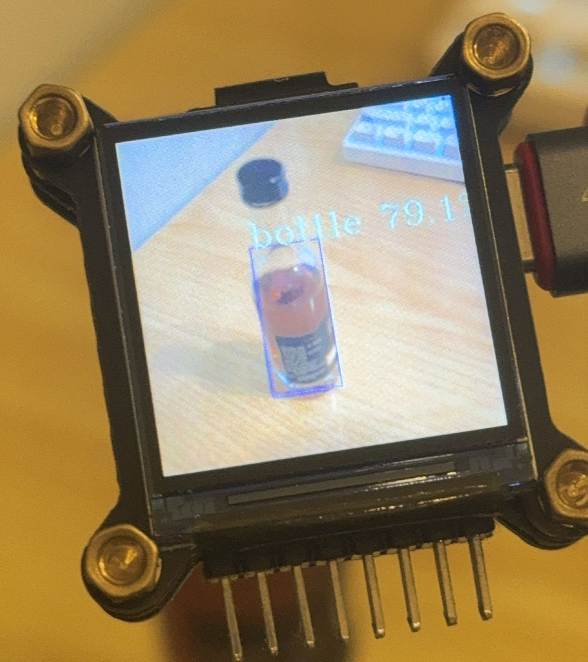


# 内核驱动支持情况

这里表述的内核驱动支持仅为部分重要模块驱动支持，对于次要模块这里略过。✅: 支持— ❌: 暂不支持 — 🚫: 无计划支持 —⚠：支持但未完整测试

| 内核版本        | Linux 4.9.191 | Linux 5.15 | Linux 6.1 | 小核 E907 RT-Thread | SyterKit 纯裸机 |
| --------------- | ------------- | ---------- | --------- | ------------------- | --------------- |
| SPI             | ✅             | ✅          | ✅         | ✅                   | ✅               |
| TWI             | ✅             | ✅          | ✅         | ✅                   | ✅               |
| PWM             | ✅             | ✅          | ✅         | ✅                   | ✅               |
| UART            | ✅             | ✅          | ✅         | ✅                   | ✅               |
| MMC             | ✅             | ✅          | ✅         | 🚫                   | ✅               |
| GPIO            | ✅             | ✅          | ✅         | ✅                   | ✅               |
| MIPI DBI Type C | ✅             | ✅          | ✅         | ✅                   | ✅               |
| 内置100M网络    | ✅             | ✅          | ✅         | 🚫                   | 🚫               |
| CE              | ✅             | ✅          | ⚠         | 🚫                   | 🚫               |
| NPU             | ✅             | ⚠          | ⚠         | 🚫                   | 🚫               |
| USB2.0          | ✅             | ✅          | ✅         | 🚫                   | 🚫               |
| E907 小核启动   | ✅             | ✅          | ✅         | ✅                   | ✅               |
| E907 小核控制   | ✅             | ⚠          | ⚠         | ✅                   | 🚫               |
| G2D             | ✅             | ✅          | ✅         | 🚫                   | 🚫               |
| 视频编码        | ✅             | ✅          | ✅         | 🚫                   | 🚫               |
| 视频解码        | ✅             | ✅          | ✅         | 🚫                   | 🚫               |
| MIPI CSI        | ✅             | ❌          | ❌         | 🚫                   | 🚫               |
| GPADC           | ✅             | ✅          | ✅         | 🚫                   | 🚫               |
| Audio           | ✅             | ❌          | ❌         | 🚫                   | 🚫               |

# 相关文档

## TinyVision 相关文档手册

- 电路原理图：https://github.com/YuzukiHD/TinyVision/tree/main/docs/hardware/TinyVision/schematic
- 3D 结构：https://github.com/YuzukiHD/TinyVision/tree/main/docs/hardware/TinyVision/3d
- BOM：https://github.com/YuzukiHD/TinyVision/tree/main/docs/hardware/TinyVision/bom
- Gerber：https://github.com/YuzukiHD/TinyVision/blob/main/docs/hardware/TinyVision/gerber/Gerber_PCB1_2023-11-13.zip
- V851 简述：https://github.com/YuzukiHD/TinyVision/blob/main/docs/hardware/TinyVision/datasheet/V851S_Brief_CN_V1.0.pdf
- V851se 手册：https://github.com/YuzukiHD/TinyVision/blob/main/docs/hardware/TinyVision/datasheet/V851SX_Datasheet_V1.2.pdf
- V851se 引脚定义：https://github.com/YuzukiHD/TinyVision/blob/main/docs/hardware/TinyVision/datasheet/V851SE_PINOUT_V1.0.xlsx
- V851 原厂参考设计：https://github.com/YuzukiHD/TinyVision/tree/main/docs/hardware/TinyVision/datasheet/ReferenceDesign
- 主电源芯片：https://github.com/YuzukiHD/TinyVision/blob/main/docs/hardware/TinyVision/datasheet/MPS-MP2122.pdf
- 3V3 电源芯片：https://github.com/YuzukiHD/TinyVision/blob/main/docs/hardware/TinyVision/datasheet/Aerosemi-MT3520B.pdf
- CSI 接口电源 LDO：https://github.com/YuzukiHD/TinyVision/blob/main/docs/hardware/TinyVision/datasheet/JSCJ-CJ6211BxxF.pdf
- SDNAND 存储芯片：https://github.com/YuzukiHD/TinyVision/blob/main/docs/hardware/TinyVision/datasheet/CS-SEMI-CSNP1GCR01-BOW.pdf
- TF 卡槽：https://github.com/YuzukiHD/TinyVision/blob/main/docs/hardware/TinyVision/datasheet/MUP-M617-2.pdf

## TinyVision WIFI 相关手册文档

- 电路原理图：https://github.com/YuzukiHD/TinyVision/blob/main/docs/hardware/TinyVision-WIFI/schematic/SCH_TinyVision-WIFI_2023-11-18.pdf
- 3D 结构：https://github.com/YuzukiHD/TinyVision/blob/main/docs/hardware/TinyVision-WIFI/3d/3D_PCB4_2023-11-18.zip
- Gerber：https://github.com/YuzukiHD/TinyVision/blob/main/docs/hardware/TinyVision-WIFI/gerber/Gerber_PCB4_2023-11-18.zip
- XR829 芯片简述：https://github.com/YuzukiHD/TinyVision/blob/main/docs/hardware/TinyVision-WIFI/datasheet/XR829_Brief.pdf
- XR829 芯片手册：https://github.com/YuzukiHD/TinyVision/blob/main/docs/hardware/TinyVision-WIFI/datasheet/XR829_Datasheet.pdf

# 相关工具

- 线刷工具[Windows/Linux]：https://github.com/YuzukiHD/TinyVision/blob/main/docs/tools/AllwinnertechPhoeniSuitRelease20230905.zip


- ISP 调试工具[Windows]：https://github.com/YuzukiHD/TinyVision/blob/main/docs/tools/TigerISPv4.2.2.7z


- WIFI 性能测试工具[Linux/Android]：https://github.com/YuzukiHD/TinyVision/blob/main/docs/tools/xradio_wlan_rf_test_tools_v2.0.9-p1.zip
- BT 性能测试工具[Linux]：https://github.com/YuzukiHD/TinyVision/blob/main/docs/tools/xradio_bt_rf_test_tools_v1.2.2.zip
- WIFI 晶振频偏发射功率修改工具[Windows]：https://github.com/YuzukiHD/TinyVision/blob/main/docs/tools/xradio_sdd_editor_ex_v2.7.210115a-p1.zip


