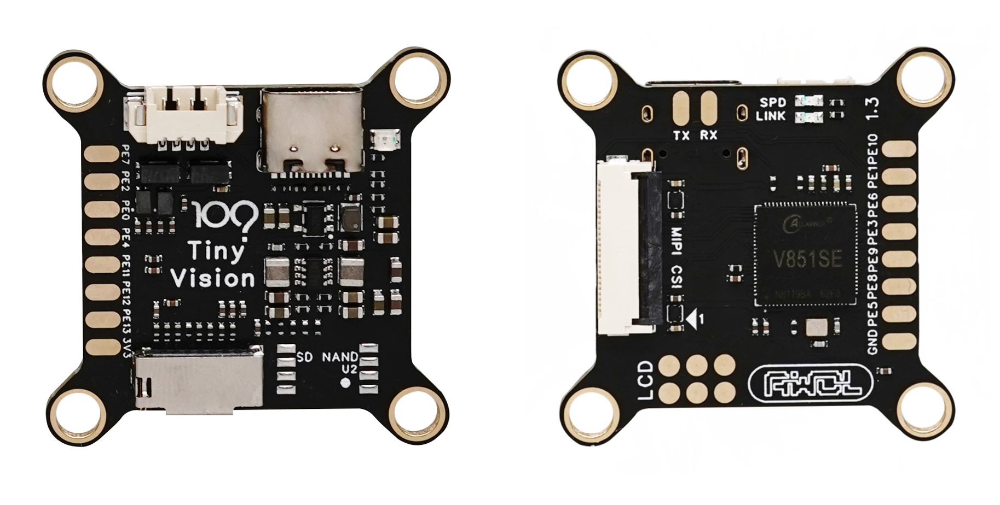
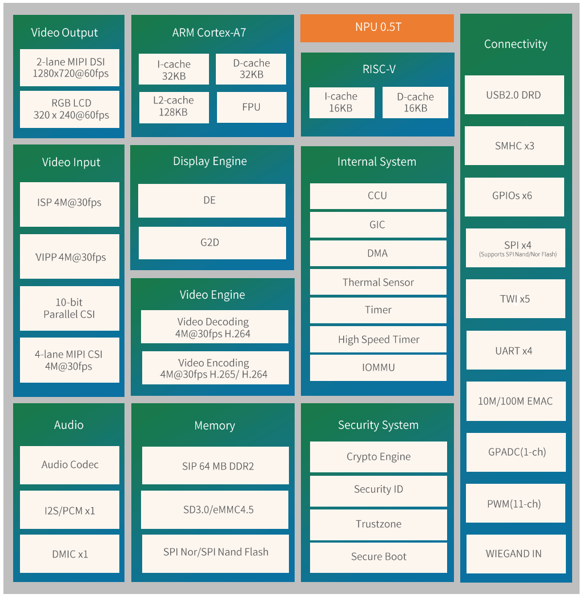
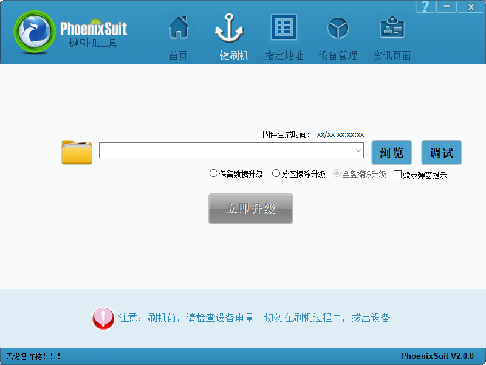
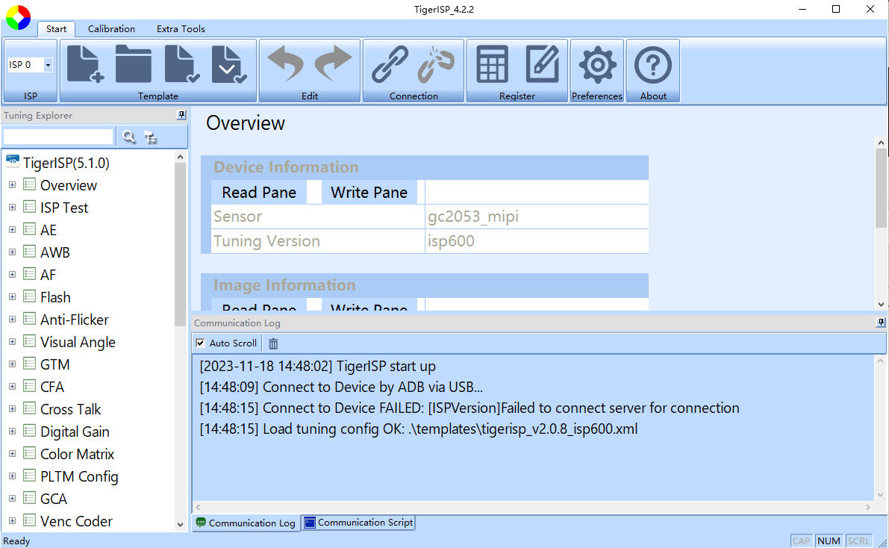
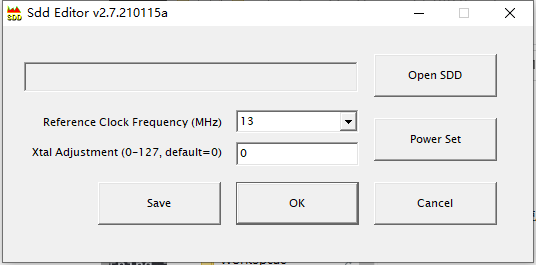

<h1 align="center">TinyVision</h1>

TinyVision - A Tiny Linux Board / IPC / Server / Router / And so on...

# 功能特性

- Based on Allwinner V851se / V851s3
- Cortex-A7 Core up to 1200MHz
- RISC-V E907GC@600MHz
- 0.5Tops@int8 NPU
- Built in 64M DDR2 (V851se) / 128M DDR3L (V851s3) memory
- One TF Card Slot, Support UHS-SDR104
- On board SD NAND
- On board USB&UART Combo
- Supports one 2-lane MIPI CSI inputs
- Supports 1 individual ISP, with maximum resolution of 2560 x 1440
- H.264/H.265 decoding at 4096x4096
- H.264/H.265 encoder supports 3840x2160@20fps
- Online Video encode
- RISC-V E907 RTOS Support, Based on RT-Thread + RTOS-HAL

# 芯片框图

## V851 系列

## 不同型号芯片的区别

| 芯片型号 | 内存       | 内置网络PHY | 显示接口                                        |
| -------- | ---------- | ----------- | ----------------------------------------------- |
| V851s    | 64M DDR2   | 无          | 2-lane MIPI + RGB + MIPI DBI TypeC, 1280x720@60 |
| V851se   | 64M DDR2   | 10/100M     | MIPI DBI TypeC, 320x240@30                      |
| V851s3   | 128M DDR3L | 无          | 2-lane MIPI + RGB + MIPI DBI TypeC, 1280x720@60 |

# 内核驱动支持情况

这里表述的内核驱动支持仅为部分重要模块驱动支持，对于次要模块这里略过。✅: 支持— ❌: 暂不支持 — 🚫: 无计划支持 —⚠：支持但未完整测试

| 内核版本        | Linux 4.9.191 | Linux 5.15 | Linux 6.1 | 小核 E907 RT-Thread | SyterKit 纯裸机 |
| --------------- | ------------- | ---------- | --------- | ------------------- | --------------- |
| SPI             | ✅             | ✅          | ✅         | ✅                   | ✅               |
| TWI             | ✅             | ✅          | ✅         | ✅                   | ❌               |
| PWM             | ✅             | ✅          | ✅         | ✅                   | ✅               |
| UART            | ✅             | ✅          | ✅         | ✅                   | ✅               |
| MMC             | ✅             | ✅          | ✅         | 🚫                   | ✅               |
| GPIO            | ✅             | ✅          | ✅         | ✅                   | ✅               |
| MIPI DBI Type C | ✅             | ✅          | ✅         | ✅                   | ❌               |
| 内置100M网络    | ✅             | ⚠          | ⚠         | 🚫                   | 🚫               |
| CE              | ✅             | ⚠          | ⚠         | 🚫                   | 🚫               |
| NPU             | ✅             | ⚠          | ⚠         | 🚫                   | 🚫               |
| USB2.0          | ✅             | ✅          | ✅         | 🚫                   | 🚫               |
| E907 小核启动   | ✅             | ✅          | ✅         | ✅                   | ✅               |
| E907 小核控制   | ✅             | ⚠          | ⚠         | ✅                   | 🚫               |
| G2D             | ✅             | ✅          | ✅         | 🚫                   | 🚫               |
| 视频编码        | ✅             | ✅          | ✅         | 🚫                   | 🚫               |
| 视频解码        | ✅             | ✅          | ✅         | 🚫                   | 🚫               |
| MIPI CSI        | ✅             | ❌          | ❌         | 🚫                   | 🚫               |
| GPADC           | ✅             | ✅          | ✅         | 🚫                   | 🚫               |
| Audio           | ✅             | ❌          | ❌         | 🚫                   | 🚫               |

# 相关文档

## TinyVision 相关文档手册

- 电路原理图：https://github.com/YuzukiHD/TinyVision/tree/main/docs/hardware/TinyVision/schematic
- 3D 结构：https://github.com/YuzukiHD/TinyVision/tree/main/docs/hardware/TinyVision/3d
- BOM：https://github.com/YuzukiHD/TinyVision/tree/main/docs/hardware/TinyVision/bom
- Gerber：https://github.com/YuzukiHD/TinyVision/blob/main/docs/hardware/TinyVision/gerber/Gerber_PCB1_2023-11-13.zip
- V851 简述：https://github.com/YuzukiHD/TinyVision/blob/main/docs/hardware/TinyVision/datasheet/V851S_Brief_CN_V1.0.pdf
- V851se 手册：https://github.com/YuzukiHD/TinyVision/blob/main/docs/hardware/TinyVision/datasheet/V851SX_Datasheet_V1.2.pdf
- V851se 引脚定义：https://github.com/YuzukiHD/TinyVision/blob/main/docs/hardware/TinyVision/datasheet/V851SE_PINOUT_V1.0.xlsx
- V851 原厂参考设计：https://github.com/YuzukiHD/TinyVision/tree/main/docs/hardware/TinyVision/datasheet/ReferenceDesign
- 主电源芯片：https://github.com/YuzukiHD/TinyVision/blob/main/docs/hardware/TinyVision/datasheet/MPS-MP2122.pdf
- 3V3 电源芯片：https://github.com/YuzukiHD/TinyVision/blob/main/docs/hardware/TinyVision/datasheet/Aerosemi-MT3520B.pdf
- CSI 接口电源 LDO：https://github.com/YuzukiHD/TinyVision/blob/main/docs/hardware/TinyVision/datasheet/JSCJ-CJ6211BxxF.pdf
- SDNAND 存储芯片：https://github.com/YuzukiHD/TinyVision/blob/main/docs/hardware/TinyVision/datasheet/CS-SEMI-CSNP1GCR01-BOW.pdf
- TF 卡槽：https://github.com/YuzukiHD/TinyVision/blob/main/docs/hardware/TinyVision/datasheet/MUP-M617-2.pdf

## TinyVision WIFI 相关手册文档

- 电路原理图：https://github.com/YuzukiHD/TinyVision/blob/main/docs/hardware/TinyVision-WIFI/schematic/SCH_TinyVision-WIFI_2023-11-18.pdf

- 3D 结构：https://github.com/YuzukiHD/TinyVision/blob/main/docs/hardware/TinyVision-WIFI/3d/3D_PCB4_2023-11-18.zip
- Gerber：https://github.com/YuzukiHD/TinyVision/blob/main/docs/hardware/TinyVision-WIFI/gerber/Gerber_PCB4_2023-11-18.zip
- XR829 芯片简述：https://github.com/YuzukiHD/TinyVision/blob/main/docs/hardware/TinyVision-WIFI/datasheet/XR829_Brief.pdf

- XR829 芯片手册：https://github.com/YuzukiHD/TinyVision/blob/main/docs/hardware/TinyVision-WIFI/datasheet/XR829_Datasheet.pdf

# 相关工具

- 线刷工具[Windows/Linux]：https://github.com/YuzukiHD/TinyVision/blob/main/docs/tools/AllwinnertechPhoeniSuitRelease20230905.zip

- ISP 调试工具[Windows]：https://github.com/YuzukiHD/TinyVision/blob/main/docs/tools/TigerISPv4.2.2.7z

- WIFI 性能测试工具[Linux/Android]：https://github.com/YuzukiHD/TinyVision/blob/main/docs/tools/xradio_wlan_rf_test_tools_v2.0.9-p1.zip
- BT 性能测试工具[Linux]：https://github.com/YuzukiHD/TinyVision/blob/main/docs/tools/xradio_bt_rf_test_tools_v1.2.2.zip
- WIFI 晶振频偏发射功率修改工具[Windows]：https://github.com/YuzukiHD/TinyVision/blob/main/docs/tools/xradio_sdd_editor_ex_v2.7.210115a-p1.zip

